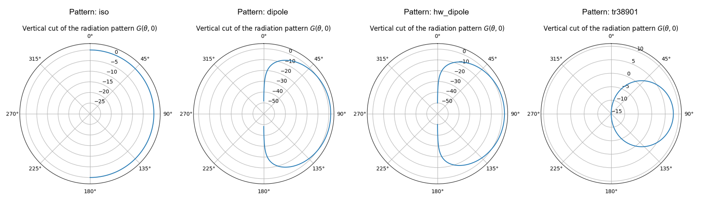
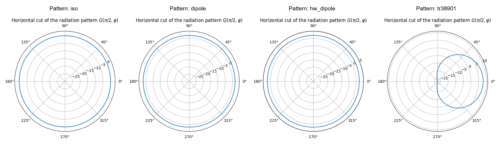
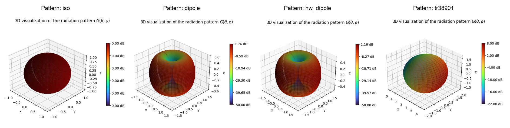
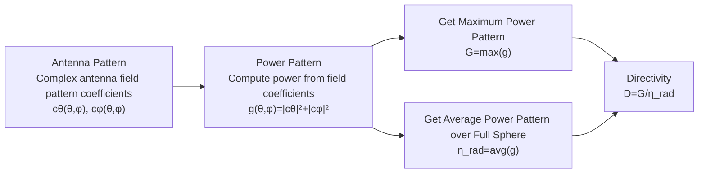
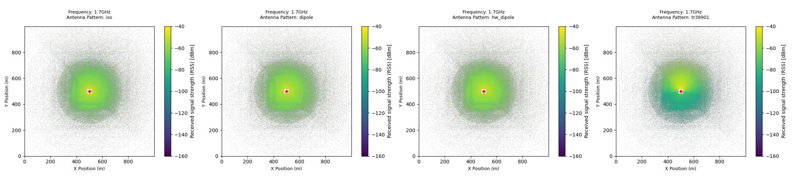
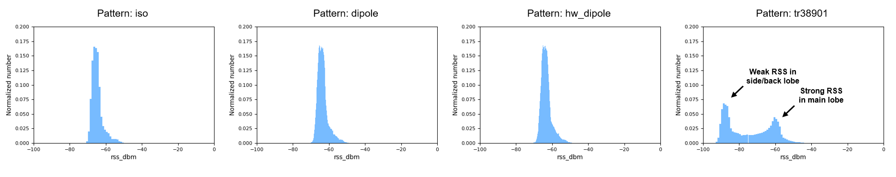

# Antenna-003: Evaluation of Pre-Installed Antenna Gain Patterns in Sionna

## Test Description

<!-- Objective and Hypothesis and Expected Output -->

There are a few pre-installed [antenna gain patterns](https://nvlabs.github.io/sionna/rt/api/antenna_pattern.html) in Sionna, such as isotropic, dipole, and 3GPP-based directional antenna patterns, to support various types of simulations. This test will export the properties of these pre-installed antennas to better understand their radiation patterns and confirm the common antenna metric computation functions, such as antenna gain, efficiency, and directivity.

!!! example "Variables in this test"

    Antenna Pattern: 'iso', 'dipole', 'hw_dipole', 'tr38901'. 'tr38901' is a standard directional antenna model defined in 3GPP TR 38.901 - Study on Channel Model for Frequencies from 0.5 to 100 GHz.

<!-- Test Scenario -->

In this test, a single transmitter is deployed above the ground plane facing north with a slight downtilt. No obstacles are deployed in the scene environment to simulate the actual radiation of the antenna gain pattern under free-space path loss conditions.

!!! quote "Constants"

    ```python
    Carrier Frequency = 1.7 GHz
    Simulation Area = 1000 x 1000 m
    Tx Power = 18 dBm
    Tx Antenna Height = 18 m
    Tx Antenna Azimuth = 0°
    Tx Antenna Tilt = 20°
    ```

## Results

<!-- Result Discussion -->

#### Result 1: Visualization of Antenna Gain Patterns in 2D and 3D

Sionna provides the [AntennaPattern.show()](https://nvlabs.github.io/sionna/rt/api/antenna_pattern.html#sionna.rt.AntennaPattern.show) function, where users can visualize the antenna pattern in both 2D vertical and horizontal cuts, as well as a 3D rendering of the antenna gain radiation pattern.

From below results, the isotropic antenna shows a perfect sphere shape with 0 dB gain in all directions. The dipole antenna shows a slight increase in gain in the horizontal plane, with a corresponding reduction in gain in the vertical plane. More gain is observed in the directional antenna when the energy is directed toward a specific direction.







#### Result 2: Antenna Gain, Directivity, and Efficiency

Sionna also provides the [AntennaPattern.compute_gain()](https://nvlabs.github.io/sionna/rt/api/antenna_pattern.html#sionna.rt.AntennaPattern.compute_gain) function, where important antenna metrics can be calculated from the antenna radiation pattern.

Below are the results computed using this function. It can be seen that the efficiency of the antenna remains at 100% when the power is radiated equally in all directions. When the energy is radiated in certain directions, some energy cannot be converted into electromagnetic waves and is instead transformed into heat, causing the radiation efficiency to be lower.

```python
Result:

'iso' Antenna Properties
Directivity [dB]: -6.37e-05
Gain [dB]: 0.0
Efficiency [%]: 1e+02 # Gain / Directivity (Linear)

'dipole' Antenna Properties
Directivity [dB]: 1.76
Gain [dB]: 1.76
Efficiency [%]: 1e+02 # Gain / Directivity (Linear)

'hw_dipole' Antenna Properties
Directivity [dB]: 2.15
Gain [dB]: 2.16
Efficiency [%]: 1e+02 # Gain / Directivity (Linear)

'tr38901' Antenna Properties
Directivity [dB]: 9.83
Gain [dB]: 8.0
Efficiency [%]: 65.7 # Gain / Directivity (Linear)
```

Sionna calculates the antenna metrics on a mesh grid, and the returned values from the function are seen to replicate the theoretical values. In simple terms, Sionna first calculates the antenna gain for every azimuth and tilt angle, obtains the maximum and average gain from the resulting array, and then calculates the directivity. Below are the theoretical formulas used in this calculation.

**Gain**: Maximum power pattern over all directions of azimuth (φ) and tilt (θ). The power pattern is computed by squaring the electric field amplitude.

$$
G = \max \left( |c_\theta|^2 + |c_\phi|^2 \right)
$$

**Efficiency**: Average power pattern over all directions of a full sphere.

$$
\eta_{\mathrm{rad}} = \frac{1}{4\pi}
\int_{0}^{2\pi}
\int_{0}^{\pi}
\left( |c_\theta|^2 + |c_\phi|^2 \right)
\sin(\theta)\, d\theta\, d\phi
$$

**Directivity**: Ratio of the maximum power pattern in a specific direction to the average power pattern over all directions.

$$
D = \frac{G}{\eta_{\mathrm{rad}}}
$$

!!! note "c Definition"

    c is a complex (real + imaginary) antenna field pattern coefficient that describes how strongly the antenna radiates. The magnitude of c, denoted as |c|, represents the electric field amplitude. Since power is proportional to the square of the electric field amplitude, |c|² is used when calculating the gain. So gain is actually power.

Below is a simplified explanation of how Sionna computes these metrics. Check out the [source code](https://nvlabs.github.io/sionna/_modules/sionna/rt/antenna_pattern.html#AntennaPattern.compute_gain).



#### Result 3: Effects of Antenna Patterns on RSS

When generating the antenna patterns using [Radio Maps](https://nvlabs.github.io/sionna/rt/api/radio_maps.html), similar observations can be made. The results provide a better visualization of the effects of antenna patterns on [RSS](https://nvlabs.github.io/sionna/rt/api/radio_maps.html#sionna.rt.RadioMap.rss).

For example, it can be seen below that the directional antenna has a higher peak RSS due to its more focused main lobe. At the same time, a larger number of weak RSS samples can also be observed, representing locations covered by the side lobes and back lobes.





#### Key Takeaway

1. Different antenna patterns produce significantly different radiation and RSS distributions.

2. Sionna's gain, directivity, and efficiency calculations are consistent with antenna theory.

3. Directional antennas increase peak RSS by concentrating energy into specific directions.

## Source Code

Reproduce the results from [source](https://github.com/zulfadlizainal/sionna-results/tree/main/src) ⬇️

<details>
  <summary>Python</summary>

```python
import numpy as np
from sionna.rt import load_scene, ITURadioMaterial, Transmitter, Receiver, PlanarArray, RadioMapSolver, PathSolver, InteractionType, Camera, AntennaPattern
import matplotlib.pyplot as plt
import pandas as pd
from collections import Counter

# Import scene from blender mitsuba export (.xml)
scene = load_scene("blender-assets/1km-field.xml")

tx_ant_pattern = "tr38901" # iso, dipole, hw_dipole, tr38901

# Add array for both Tx
scene.tx_array = PlanarArray(num_rows=1, 
                             num_cols=1,
                             vertical_spacing=0.5,
                             horizontal_spacing=0.5,
                             pattern=tx_ant_pattern,
                             polarization="V")

# Show antenna pattern properties
print(f"'{tx_ant_pattern}' Antenna Properties")
scene.tx_array.antenna_pattern.compute_gain()
scene.tx_array.antenna_pattern.show()

# Add frequency to scene
carrier_freq = 1.7e9 # In Hz
scene.frequency = carrier_freq

# Helper function to sync transmitter azimuth 0 degree with scene 0 degree
def compass_orientation(azimuth_deg, tilt_deg=0, roll_deg=0):

    # Sionna by default implement 0 degree Tx azimuth at X+ axis, -90 to achieve 0 degree at Y+ axis (North)
    sionna_azimuth = (90 - azimuth_deg) % 360

    # return radian
    return [
        float(np.deg2rad(sionna_azimuth)),
        float(np.deg2rad(tilt_deg)),
        float(np.deg2rad(roll_deg))
    ]

# Deploy Tx
tx_azimuth_deg = 0
tx_tilt_deg = 20

# Deploy Tx and Rx location
tx = Transmitter(
    "tx",
    position = [0, 0, 18], # x, y, z (location and height, in meter)
    orientation=compass_orientation(azimuth_deg=tx_azimuth_deg,tilt_deg=tx_tilt_deg), 
    power_dbm=18
)

# Deploy Rx
rx_azimuth_deg = 0
rx_tilt_deg = 0

rx = Receiver(
    "rx",
    [0, 500, 1.5],
    orientation=[
        float(np.deg2rad(rx_azimuth_deg)), float(np.deg2rad(rx_tilt_deg)), 0.0]
)

# Add Tx and Rx to the scene
scene.add(tx)
scene.add(rx)

# Plot 2D Radio Map
rm_solver = RadioMapSolver()

rm = rm_solver(
    scene,
    max_depth=10,
    samples_per_tx=10**7,
    cell_size=(1, 1),
    center=[0, 0, 0],
    size=[1000, 1000],
    orientation=[0, 0, 0]
)

plt.figure(figsize=(4, 4))
rm.show(metric="rss")
plt.title(
    f"Frequency: {carrier_freq/1e9}GHz\nAntenna Pattern: {tx_ant_pattern}",
    fontsize=9,
    pad=15
)
plt.xlabel("X Position (m)", fontsize=9)
plt.ylabel("Y Position (m)", fontsize=9)
plt.clim(-160, -40)
plt.grid(
    alpha=0.2,
    linestyle="--"
)
plt.tight_layout()
plt.show()

# Test

rss = rm.rss.numpy()[0]

# Extract non-zero values
rss_list = rss[rss != 0].flatten()

# Convert to dataframe
df = pd.DataFrame({
    "rss": rss_list
})

df["rss_dbm"] = 10 * np.log10(df["rss"]) +30

# Export
df.to_csv(
    f"export_rss_{tx_ant_pattern}.csv",
    index=False
)
```

</details>
