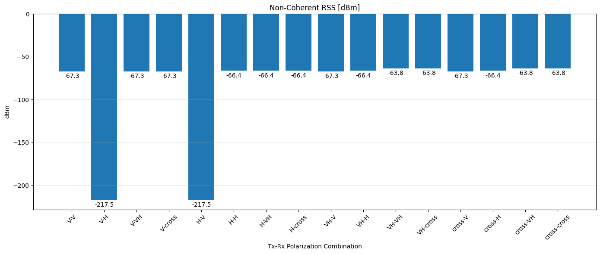
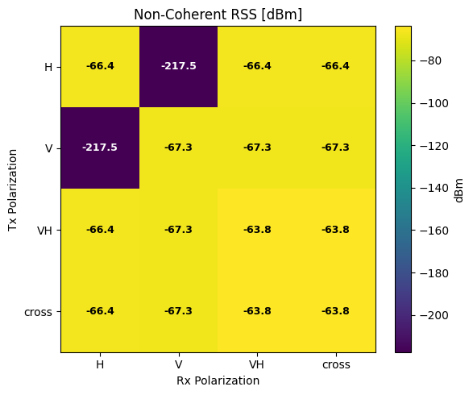

# Antenna-004: Effect of Different Tx-Rx Polarization Combinations

## Test Description

<!-- Objective, Hypothesis, and Expected Output -->

When defining a [PlanarArray](https://nvlabs.github.io/sionna/rt/api/antenna_array.html#sionna.rt.PlanarArray) for an implemented [Transmitter](https://nvlabs.github.io/sionna/rt/api/radio_devices.html#sionna.rt.Transmitter) and [Receiver](https://nvlabs.github.io/sionna/rt/api/radio_devices.html#sionna.rt.Receiver) in Sionna, the class allows the user to deploy antenna elements with different polarization configurations, such as Vertical, Horizontal, Vertical & Horizontal, and Cross Polarization. In this experiment, the effect on [RSS](https://nvlabs.github.io/sionna/rt/api/radio_maps.html#sionna.rt.RadioMap.rss) in receiver is investigated when using co-polarized configurations (similar polarization at the Tx and Rx) and cross-polarized configurations (different polarization at the Tx and Rx).

!!! example "Variables in this test"

    Antenna Element Polarization: "V", "H", "VH", "cross". V stands for Vertical polarization, H stands for Horizontal polarization, VH stands for Dual-polarized of Vertical and Horizontal, and cross stands for Cross-polarized antenna element.

<!-- Test Scenario -->

In this test, a single transmitter is deployed above the ground plane facing north with a slight downtilt. No obstacles are deployed in the scene environment to simulate the actual radiation under free-space path loss conditions without any blockage influence.

!!! quote "Constants"

    ```python
    Carrier Frequency = 1.7 GHz
    Simulation Area = 1000 x 1000 m
    Tx Power = 18 dBm
    Tx Antenna Height = 18 m
    Tx Antenna Azimuth = 0°
    Tx Antenna Tilt = 10°
    ```

## Results

<!-- Result Discussion -->

#### Result 1: Received Signal Strength at Receiver for Different Tx-Rx Polarization Combinations

Based on the simulation results, it can be observed that RSS is highly affected by the polarization combination between the Tx and Rx. When the receiver is able to decode a signal from a similar (or closely similar) transmit signal polarization component, the RSS is high. On the other hand, if the polarization is a total mismatch, the RSS is very low.

For example, when the transmitter is V and the receiver is H, the signal polarization is a total mismatch and the receiver is unable to decode the signal efficiently (RSS very low at -217.5 dBm). When there is a complete match, such as V-V or H-H, the RSS becomes much higher (RSS around ~-66 dBm).



Not only that, if both the transmitter and receiver use at least two polarizations, either Dual Polarization (V+H) or Cross Polarization (X), the RSS is roughly 3 dB higher compared to cases where only one of the Tx or Rx uses a dual-polarized antenna, or when neither the Tx nor Rx uses a dual-polarized antenna. This is one of the reasons why most modern devices use cross-polarized antennas.



!!! info "Why Coherent RSS is not presented in this analysis"

    Coherent RSS can be calculated, but it should be calculated separately for each antenna port. For example, if the antenna uses Dual Polarization or Cross Polarization, each port should be calculated separately. The objective of this test is to evaluate the effect of different Tx-Rx polarization combinations on the total received signal strength. Therefore, only Non-Coherent RSS is presented, as it represents the total received power across all available polarization ports.

#### Result 2: Channel Coefficients (a) Change Based on Tx-Rx Polarization Combinations

Sionna allows users to extract the [Channel Coefficients (a)](https://nvlabs.github.io/sionna/rt/api/paths.html#sionna.rt.Paths.a) property through the [Paths](https://nvlabs.github.io/sionna/rt/api/paths.html#sionna.rt.Paths) class. This property stores a tensor with the shape `Tuple[mi.TensorXf] [num_rx, num_rx_ant, num_tx, num_tx_ant, num_paths]`, which includes the `num_rx_ant` and `num_tx_ant` dimensions.

As shown in the results below, when a Dual-Polarized or Cross-Polarized antenna is used, the number of antenna increases from 1 to 2. This is an important point to take note of when performing path analysis using the [Paths.a](https://nvlabs.github.io/sionna/rt/api/paths.html#sionna.rt.Paths.a) property, as the dimensions of the channel coefficient tensor change depending on the polarization configuration used.

| tx_pol | rx_pol | combination | rss_non_coherent | num_rx | num_rx_ant | num_tx | num_tx_ant | num_paths |
|--------|--------|-------------|------------------|--------|------------|--------|------------|-----------|
| V      | V      | V-V         | -67.31479        | 1      | 1          | 1      | 1          | 2         |
| V      | H      | V-H         | -217.50598       | 1      | 1          | 1      | 1          | 2         |
| V      | VH     | V-VH        | -67.31479        | 1      | 2          | 1      | 1          | 2         |
| V      | cross  | V-cross     | -67.31479        | 1      | 2          | 1      | 1          | 2         |
| H      | V      | H-V         | -217.48434       | 1      | 1          | 1      | 1          | 2         |
| H      | H      | H-H         | -66.40853        | 1      | 1          | 1      | 1          | 2         |
| H      | VH     | H-VH        | -66.40853        | 1      | 2          | 1      | 1          | 2         |
| H      | cross  | H-cross     | -66.40853        | 1      | 2          | 1      | 1          | 2         |
| VH     | V      | VH-V        | -67.31479        | 1      | 1          | 1      | 2          | 2         |
| VH     | H      | VH-H        | -66.40853        | 1      | 1          | 1      | 2          | 2         |
| VH     | VH     | VH-VH       | -63.827766       | 1      | 2          | 1      | 2          | 2         |
| VH     | cross  | VH-cross    | -63.827766       | 1      | 2          | 1      | 2          | 2         |
| cross  | V      | cross-V     | -67.31479        | 1      | 1          | 1      | 2          | 2         |
| cross  | H      | cross-H     | -66.40853        | 1      | 1          | 1      | 2          | 2         |
| cross  | VH     | cross-VH    | -63.827766       | 1      | 2          | 1      | 2          | 2         |
| cross  | cross  | cross-cross | -63.827766       | 1      | 2          | 1      | 2          | 2         |

### Key Takeaways

1. Matching polarizations between the Tx and Rx produce significantly higher RSS than mismatched polarizations.

2. Using dual-polarized and cross-polarized antennas at both the Tx and Rx provides approximately 3 dB higher RSS compared to using them only at either the Tx or Rx, or at neither.

3. The number of antenna ports in `Paths.a` changes with the antenna polarization configuration.

## Source Code

Reproduce the results from [source](https://github.com/zulfadlizainal/sionna-results/tree/main/src) ⬇️

<details>
  <summary>Python</summary>

```python
# Import libraries
import numpy as np
from sionna.rt import load_scene, ITURadioMaterial, Transmitter, Receiver, PlanarArray, RadioMapSolver, PathSolver, Camera
import matplotlib.pyplot as plt
import pandas as pd
import os

# Import scene from blender mitsuba export (.xml)
scene = load_scene("blender-assets/1km-field.xml")

# Add frequency to scene
carrier_freq = 1.7e9 # In Hz
scene.frequency = carrier_freq

# Deploy Tx and Rx location

# Helper function to sync transmitter 0 degree with scene 0 degree
def compass_orientation(azimuth_deg, tilt_deg=0, roll_deg=0):

    # Sionna by default implement 0 degree Tx at X+ axis, -90 to achieve 0 degree at Y+ axis (North)
    sionna_azimuth = (90 - azimuth_deg) % 360

    # return radian
    return [
        float(np.deg2rad(sionna_azimuth)),
        float(np.deg2rad(tilt_deg)),
        float(np.deg2rad(roll_deg))
    ]

# Deploy Tx
tx_azimuth_deg = 0
tx_tilt_deg = 10

tx = Transmitter(
    "tx",
    position = [0, -400, 18], # x, y, z (location and height, in meter)
    orientation=compass_orientation(azimuth_deg=tx_azimuth_deg,tilt_deg=tx_tilt_deg), 
    power_dbm=18
)

tx_power_dbm = tx.power_dbm[0]

# Deploy Rx
rx_azimuth_deg = 0
rx_tilt_deg = 0

rx = Receiver(
    "rx",
    [0, 400, 1.5],
    orientation=[
        float(np.deg2rad(rx_azimuth_deg)), float(np.deg2rad(rx_tilt_deg)), 0.0]
)

# Point Rx to face Tx direction
rx.look_at(tx.position)

# Add Tx and Rx to the scene
scene.add(tx)
scene.add(rx)

# Loop different polarization combination
polarizations = ["V", "H", "VH", "cross"]

results = []

p_solver = PathSolver()

for tx_pol in polarizations:
    for rx_pol in polarizations:

        print(f"\ntx_pol={tx_pol}, rx_pol={rx_pol}")

        # Update Tx array
        scene.tx_array = PlanarArray(
            num_rows=1,
            num_cols=1,
            vertical_spacing=0.5,
            horizontal_spacing=0.5,
            pattern="tr38901",
            polarization=tx_pol
        )

        # Update Rx array
        scene.rx_array = PlanarArray(
            num_rows=1,
            num_cols=1,
            vertical_spacing=0.5,
            horizontal_spacing=0.5,
            pattern="iso",
            polarization=rx_pol
        )

        # Run path solver
        p_solver = PathSolver()

        paths = p_solver(
            scene,
            max_depth=10,
            samples_per_src=10**6
        )

        # Extract path coefficients (a function return 2 components: a_real, a_imag)
        a_real, a_imag = paths.a
        print("a_real shape:", a_real.shape)

        a_real = a_real.numpy()
        a_imag = a_imag.numpy()

        # Reconstruct complex channel coefficients in real and imaginary form
        a = a_real + 1j * a_imag

        # Extract a coefficient
        num_rx = a.shape[0]
        num_rx_ant = a.shape[1]
        num_tx = a.shape[2]
        num_tx_ant = a.shape[3]
        num_paths = a.shape[-1]
        print(f"Total Receiver: {num_rx}")
        print(f"Total Receiver Antenna (Polarization Count): {num_rx_ant}")
        print(f"Total Transmitter: {num_tx}")
        print(f"Total Transmitter Antenna (Polarization Count): {num_tx_ant}")
        print(f"Total paths found: {num_paths}")

        # Non-coherent RSS
        rss_non_coherent = (
            tx_power_dbm
            + 10*np.log10(
                max(np.sum(np.abs(a)**2), 1e-30)
            )
        )

        # # Coherent RSS (Not meaningful for this test - Coherent should be calculated per antenna port.)
        # # E.g. If "VH", means have 2 antenna port, means need to calculate coherent for V and for H separately
        # rss_coherent = (
        #     tx_power_dbm
        #     + 10*np.log10(
        #         max(np.abs(np.sum(a))**2, 1e-30)
        #     )
        # )

        results.append({
            "tx_pol": tx_pol,
            "rx_pol": rx_pol,
            "combination": f"{tx_pol}-{rx_pol}",
            "rss_non_coherent": rss_non_coherent,
            "num_rx": num_rx,
            "num_rx_ant": num_rx_ant,
            "num_tx": num_tx,
            "num_tx_ant": num_tx_ant,
            "num_paths": num_paths
        })

# Results dataframe
df_results = pd.DataFrame(results)
print("\nPOLARIZATION SWEEP RESULTS\n")
print(df_results)

df_results.to_csv(
    "output/export_rss_polarization.csv",
    index=False
)

# Plot Non Coherent RSS
plt.figure(figsize=(14, 6))

bars = plt.bar(
    df_results["combination"],
    df_results["rss_non_coherent"]
)

plt.bar_label(
    bars,
    fmt="%.1f",
    padding=3
)

plt.title("Non-Coherent RSS [dBm]")
plt.xlabel("Tx-Rx Polarization Combination")
plt.ylabel("dBm")
plt.xticks(rotation=45)
plt.grid(axis="y", alpha=0.3)
plt.tight_layout()
plt.show()

# RSS Matrix Heatmap
rss_matrix = df_results.pivot(
    index="tx_pol",
    columns="rx_pol",
    values="rss_non_coherent"
)

plt.figure(figsize=(6,5))

im = plt.imshow(rss_matrix, aspect="auto", cmap="viridis")

plt.colorbar(im, label="dBm")

plt.xticks(
    range(len(rss_matrix.columns)),
    rss_matrix.columns
)

plt.yticks(
    range(len(rss_matrix.index)),
    rss_matrix.index
)

threshold = np.mean(rss_matrix.values)

for i in range(rss_matrix.shape[0]):
    for j in range(rss_matrix.shape[1]):

        value = rss_matrix.iloc[i, j]

        text_color = (
            "white"
            if value < threshold
            else "black"
        )

        plt.text(
            j,
            i,
            f"{value:.1f}",
            ha="center",
            va="center",
            color=text_color,
            fontsize=9,
            fontweight="bold"
        )

plt.xlabel("Rx Polarization")
plt.ylabel("Tx Polarization")
plt.title("Non-Coherent RSS [dBm]")
plt.tight_layout()
plt.show()

# # # Optional - Scene Preview
# # scene.preview()

# Optional - Scene Preview (Radio Map)
rm_solver = RadioMapSolver()

rm = rm_solver(
        scene,
        max_depth=10, # Number of maximum iteration allowed per paths
        samples_per_tx=10**7, # Number of rays launch in transmitter
        cell_size=(1, 1),
        center=[0, 0, 0],
        size=[1000, 1000], # Size of area to simulate (meter)
        orientation=[0, 0, 0]
    )

# Optional - Scene Preview (Paths)
p_solver = PathSolver()

paths = p_solver(
    scene,
    max_depth=10,
    samples_per_src=10**7
)

scene.preview(
    paths=paths,
    radio_map=rm,

    rm_metric="rss",
    rm_db_scale=True,

    rm_vmax = -40,
    rm_vmin = -160,

    show_devices=True,
    show_orientations=True,

    point_picker=False
)
```

</details>
