# Antenna-005: Effect of Increasing Antenna Array Elements in MIMO Antennas

## Test Description

<!-- Objective, Hypothesis, and Expected Output -->

When implementing antenna devices in Sionna, either a [Transmitter](https://nvlabs.github.io/sionna/rt/api/radio_devices.html#sionna.rt.Transmitter) or a [Receiver](https://nvlabs.github.io/sionna/rt/api/radio_devices.html#sionna.rt.Receiver), Sionna allows users to configure the antenna array through the [PlanarArray](https://nvlabs.github.io/sionna/rt/api/antenna_array.html#sionna.rt.PlanarArray) class. If more than one antenna element is deployed, the antenna becomes MIMO (>1T1R) instead of SISO (1T1R). This test investigates the effect of increasing the number of antenna elements in an antenna by increasing the size of the antenna array at the transmitter. The effect on [RSS](https://nvlabs.github.io/sionna/rt/api/radio_maps.html#sionna.rt.RadioMap.rss) at the receiver and the overall changes in the [Radio Map](https://nvlabs.github.io/sionna/rt/api/radio_map_solvers.html) coverage pattern will be evaluated.

!!! example "Variables in this test"

    Tx Antenna Array (row, col): (1,1), (2,1), (2,2), (4,2), (4,4), (8,4), (8,8). When cross-polarization (X) or VH-polarization (+) is used, (1,1) = 2T (2 antenna element) because 1 row × 1 column × 2 polarizations.

<!-- Test Scenario -->

In this test, a single transmitter is deployed above the ground plane facing north with a slight downtilt. No obstacles are deployed in the scene environment to simulate antenna radiation under free-space path loss conditions without any blockage influence. Below are example [Radio Map RSS](https://nvlabs.github.io/sionna/rt/api/radio_map_solvers.html) and [Paths](https://nvlabs.github.io/sionna/rt/api/paths_solvers.html) scene results for a 128T antenna implementation, where 🔴 represents the transmitter and 🟢 represents the receiver.

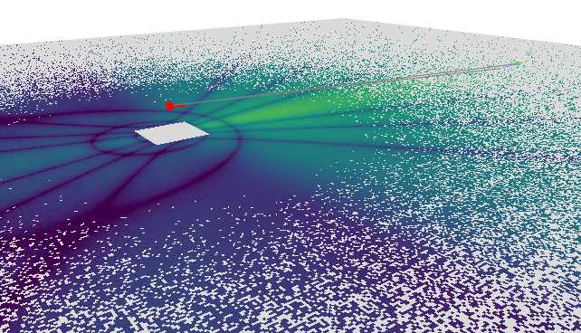

!!! quote "Constants"

    ```python
    Carrier Frequency = 3.9 GHz
    Simulation Area = 1000 x 1000 m
    Tx Power = 18 dBm
    Tx Antenna Height = 18 m
    Tx Antenna Azimuth = 0°
    Tx Antenna Tilt = 10°
    Tx Antenna Pattern = tr38901
    Tx Antenna Polarization = Cross (X)
    Tx Antenna Spacing = 0.5 λ
    Rx Antenna Height = 1.5 m
    Rx Antenna Pattern = iso
    Rx Antenna Polarization = Cross (X)
    Rx Antenna Element Count = 2
    ```

## Results

<!-- Result Discussion -->

#### Result 1: Antenna Array Visualization

Sionna provides the [array.show()](https://nvlabs.github.io/sionna/rt/api/antenna_array.html#example) function, which allows the implemented [PlanarArray](https://nvlabs.github.io/sionna/rt/api/antenna_array.html#sionna.rt.PlanarArray) to be visualized based on the configured parameters. This class allows users to implement a planar array with configurable horizontal and vertical spacing between antenna elements in wavelength units, derived from the defined carrier frequency. For example, when the transmitter is configured with 0.5 λ spacing between antenna elements at 3.9 GHz, the absolute spacing between adjacent antenna elements is 3.85 cm.

```python
Result:

Carrier frequency: 3.90 GHz
1λ = 0.08 m (7.69 cm)
0.5λ = 0.04 m (3.85 cm)
0.25λ = 0.02 m (1.92 cm)
2λ = 0.15 m (15.38 cm)
10λ = 0.77 m (76.92 cm)
```

Below are visualizations generated using the [array.show()](https://nvlabs.github.io/sionna/rt/api/antenna_array.html#example) function. Since Sionna does not currently support Sub Array grouping implementation, the figures below assume that each antenna array configuration (row × col) is in its own sub array, i.e., (1×1)SA. For the cross-polarization case, a (1x1) array with (1×1)SA transmitter requires 2 radio chains (2T). Larger grouping of antenna arrays into sub arrays would reduce the number of required radio chains in the antenna. For more details, see the [Appendix](Antenna-005/#appendix) section for the definition of sub arrays.

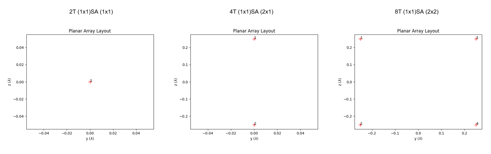

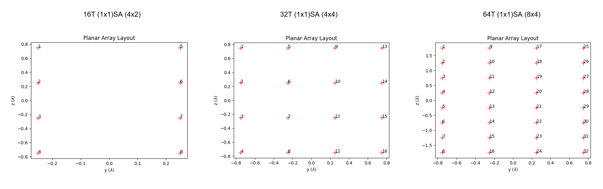

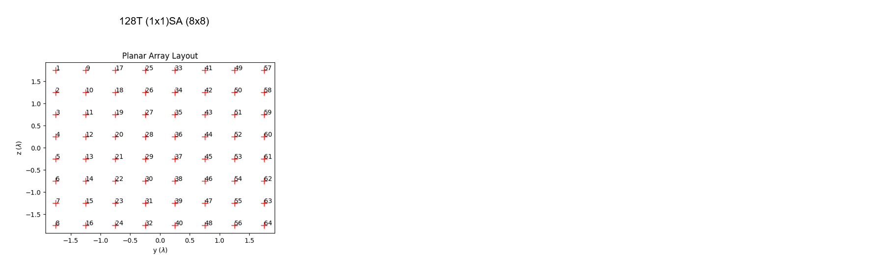

!!! warning "Sionna Does Not Support Sub Array Grouping Implementation"

    Sionna does not support sub array grouping implementation. Therefore, for this test, all antenna elements are considered to be in their own sub array.

    | tx_rows | tx_cols | tx_array | sub_array | polarization | radio_chain | mimo_type          |
    |---------|---------|----------|-----------|--------------|-------------|--------------------|
    | 1       | 1       | 1x1      | 1x1       | 2            | 2           | 2T (1x1)SA (1x1)   |
    | 2       | 1       | 2x1      | 1x1       | 2            | 4           | 4T (1x1)SA (2x1)   |
    | 2       | 2       | 2x2      | 1x1       | 2            | 8           | 8T (1x1)SA (2x2)   |
    | 4       | 2       | 4x2      | 1x1       | 2            | 16          | 16T (1x1)SA (4x2)  |
    | 4       | 4       | 4x4      | 1x1       | 2            | 32          | 32T (1x1)SA (4x4)  |
    | 8       | 4       | 8x4      | 1x1       | 2            | 64          | 64T (1x1)SA (8x4)  |
    | 8       | 8       | 8x8      | 1x1       | 2            | 128         | 128T (1x1)SA (8x8) |

#### Result 2: 2D/3D Received Signal Strength Radio Map

Observation of both the 2D and 3D radio maps shows that increasing the number of antenna elements in the transmitter planar array directly improves the antenna gain in the main lobe direction. This observation is aligned with the theoretical expectation described in the [Appendix](Antenna-005/#appendix) section.

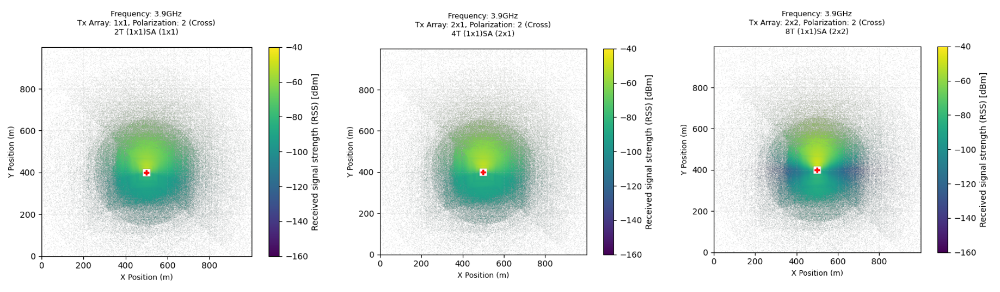

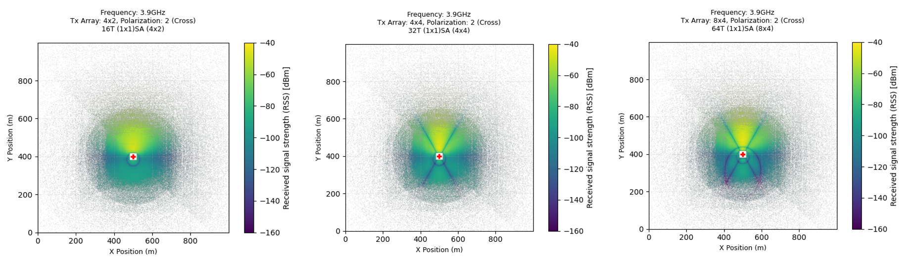

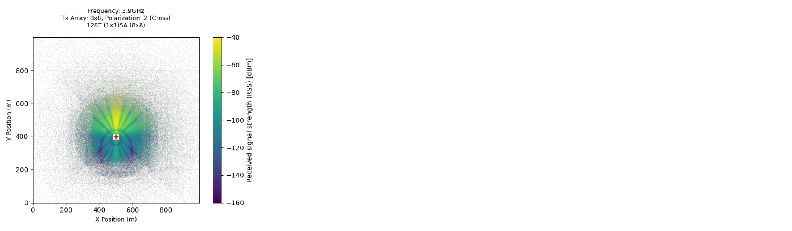

For example, in the 128T configuration, the antenna gain increases by approximately 7 times compared to the 2T configuration. In addition, the increased gain in the main lobe causes the beamwidth angle to shrink, resulting in a more focused radiation pattern.

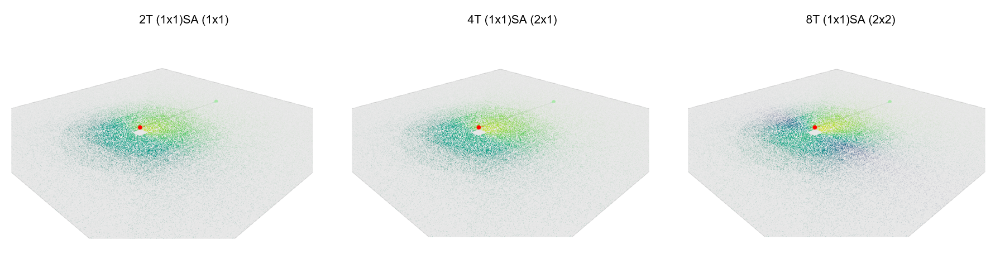

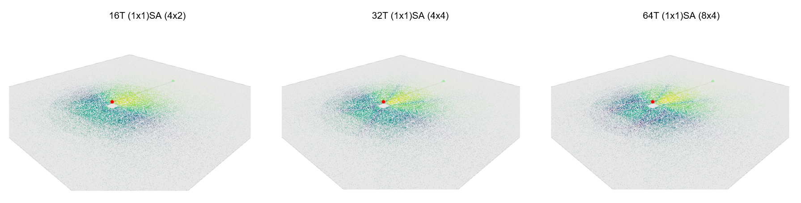

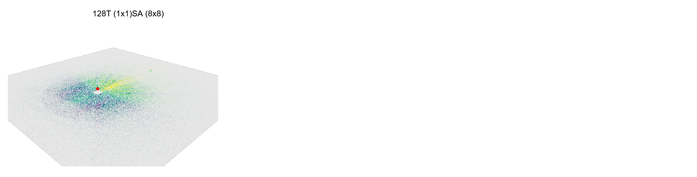

#### Result 3: RSS Gain at the Receiver

Placing the receiver in the direction of the transmitter's main lobe allows the maximum antenna gain produced by the transmitter to be measured. As shown below, whenever the number of transmitter antenna elements is doubled, the received signal strength (RSS) at the receiver also doubles in linear scale.

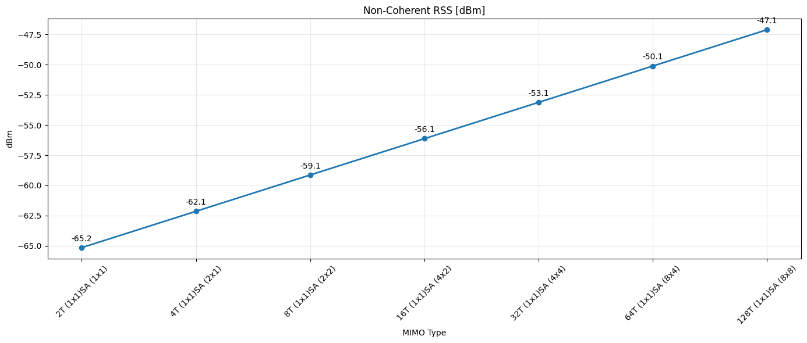

From 2T to 128T, the RSS increases by approximately 3 dB each time the number of antenna elements is doubled. This observation is consistent with antenna array theory, where doubling the number of coherent antenna elements results in approximately 3 dB additional array gain, as seen in the [Appendix](Antenna-005/#appendix) section.

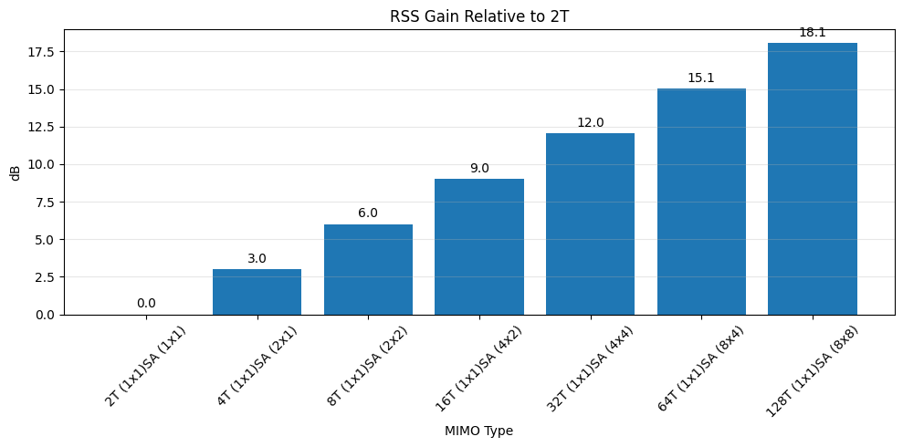

### Appendix

The figures below are referenced from [Ericsson](https://foryou.ericsson.com/massive-mimo-extended-fourth-edition-registration.html). The figure illustrates the concept of sub arrays, where the number of required radio chains can be reduced by increasing the size of each sub array. Instead of assigning one radio chain to each antenna element, multiple antenna elements can be grouped into a single sub array and share the same radio chain.

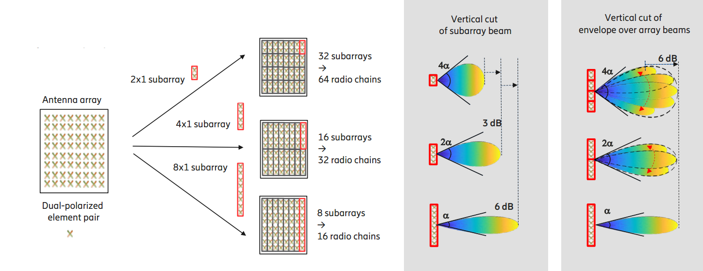

The below figure illustrates how increasing the number of antenna elements in an array increases the gain in the main lobe direction. As the array size increases, the antenna beam becomes more focused, resulting in a narrower half-power beamwidth (HPBW) and higher antenna gain.

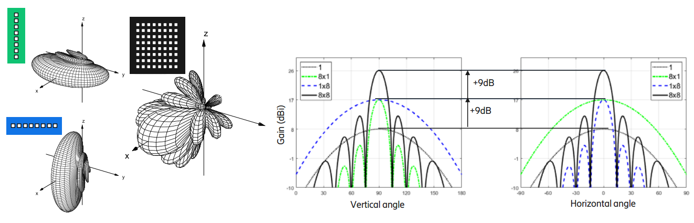

### Key Takeaways

1. Increasing the number of antenna elements increases antenna gain and RSS in the main lobe direction.

2. Doubling the number of antenna elements provides approximately 3 dB additional array gain.

3. Higher array gain results in a narrower beamwidth and a more focused coverage pattern.

## Source Code

Reproduce the results from [source](https://github.com/zulfadlizainal/sionna-results/tree/main/src) ⬇️

<details>
  <summary>Python</summary>

```python
# Import libraries
import numpy as np
from sionna.rt import load_scene, ITURadioMaterial, Transmitter, Receiver, PlanarArray, RadioMapSolver, PathSolver, Camera
import matplotlib.pyplot as plt
import pandas as pd
import os

# Import scene from blender mitsuba export (.xml)
scene = load_scene("blender-assets/1km-field.xml")

# Add frequency to scene
carrier_freq = 3.9e9 # In Hz
scene.frequency = carrier_freq

# Print frequency and lamda
c = 3e8
lam = c / carrier_freq
print(f"Carrier frequency: {carrier_freq/1e9:.2f} GHz")
print(f"1λ = {lam:.2f} m ({lam*100:.2f} cm)")
print(f"0.5λ = {lam/2:.2f} m ({lam/2*100:.2f} cm)")
print(f"0.25λ = {lam/4:.2f} m ({lam/4*100:.2f} cm)")
print(f"2λ = {lam*2:.2f} m ({lam*2*100:.2f} cm)")
print(f"10λ = {lam*10:.2f} m ({lam*10*100:.2f} cm)")

# Deploy Tx and Rx location

# Helper function to sync transmitter 0 degree with scene 0 degree
def compass_orientation(azimuth_deg, tilt_deg, roll_deg=0):

    # Sionna by default implement 0 degree Tx at X+ axis, -90 to achieve 0 degree at Y+ axis (North)
    sionna_azimuth = (90 - azimuth_deg) % 360

    # return radian
    return [
        float(np.deg2rad(sionna_azimuth)),
        float(np.deg2rad(tilt_deg)),
        float(np.deg2rad(roll_deg))
    ]

# Deploy Tx
tx_azimuth_deg = 0
tx_tilt_deg = 10

tx = Transmitter(
    "tx",
    position = [0, -100, 18], # x, y, z (location and height, in meter)
    orientation=compass_orientation(azimuth_deg=tx_azimuth_deg,tilt_deg=tx_tilt_deg), 
    power_dbm=18
)

tx_power_dbm = tx.power_dbm[0]

# Deploy Rx
rx_azimuth_deg = 0
rx_tilt_deg = 0

rx = Receiver(
    "rx",
    [0, 300, 1.5],
    orientation=[
        float(np.deg2rad(rx_azimuth_deg)), float(np.deg2rad(rx_tilt_deg)), 0.0]
)

# Point Rx to face Tx direction
rx.look_at(tx.position)

# Add Tx and Rx to the scene
scene.add(tx)
scene.add(rx)

# Loop different array size
tx_array_sizes = [
    (1,1),     # 1
    (2,1),     # 2
    (2,2),     # 4
    (4,2),     # 8
    (4,4),     # 16
    (8,4),     # 32
    (8,8)      # 64
]

results = []

p_solver = PathSolver()

for num_rows, num_cols in tx_array_sizes:

    print(f"\n=== Tx Array = {num_rows}x{num_cols}\n=== {num_rows*num_cols*2}T (1x1)SA ({num_rows}x{num_cols})")

    # Update Tx array
    scene.tx_array = PlanarArray(
        num_rows=num_rows,
        num_cols=num_cols,
        vertical_spacing=0.5,
        horizontal_spacing=0.5,
        pattern="tr38901",
        polarization="cross"
    )

    scene.tx_array.show()

    # Update Rx array
    scene.rx_array = PlanarArray(
        num_rows=1,
        num_cols=1,
        vertical_spacing=0.5,
        horizontal_spacing=0.5,
        pattern="iso",
        polarization="cross"
    )

    # Run path solver
    p_solver = PathSolver()

    paths = p_solver(
        scene,
        max_depth=10,
        samples_per_src=10**6
    )

    # Extract path coefficients (a function return 2 components: a_real, a_imag)
    a_real, a_imag = paths.a
    print("a_real shape:", a_real.shape)

    a_real = a_real.numpy()
    a_imag = a_imag.numpy()

    # Reconstruct complex channel coefficients in real and imaginary form
    a = a_real + 1j * a_imag

    # Extract a coefficient
    num_rx = a.shape[0]
    num_rx_ant = a.shape[1]
    num_tx = a.shape[2]
    num_tx_ant = a.shape[3]
    num_paths = a.shape[-1]
    print(f"Total Receiver: {num_rx}")
    print(f"Total Receiver Antenna (Polarization Count): {num_rx_ant}")
    print(f"Total Transmitter: {num_tx}")
    print(f"Total Transmitter Antenna (Polarization Count): {num_tx_ant}")
    print(f"Total paths found: {num_paths}")

    # Non-coherent RSS
    rss_non_coherent = (
        tx_power_dbm
        + 10*np.log10(
            max(np.sum(np.abs(a)**2), 1e-30)
        )
    )

    # # Coherent RSS
    # rss_coherent = (
    #     tx_power_dbm
    #     + 10*np.log10(
    #         max(np.abs(np.sum(a))**2, 1e-30)
    #     )
    # )

    results.append({
        "tx_rows": num_rows,
        "tx_cols": num_cols,
        "tx_array": f"{num_rows}x{num_cols}",
        "mimo_type": f"{num_rows*num_cols*2}T (1x1)SA ({num_rows}x{num_cols})",
        "rss_non_coherent": rss_non_coherent,
        "num_rx": num_rx,
        "num_rx_ant": num_rx_ant,
        "num_tx": num_tx,
        "num_tx_ant": num_tx_ant,
        "num_paths": num_paths
    })

    # Plot 2D Radio Map
    rm_solver = RadioMapSolver()

    rm = rm_solver(
        scene,
        max_depth=10,
        samples_per_tx=10**7,
        cell_size=(1, 1),
        center=[0, 0, 0],
        size=[1000, 1000],
        orientation=[0, 0, 0]
    )

    plt.figure(figsize=(4, 4))
    rm.show(metric="rss")
    plt.title(
        f"Frequency: {carrier_freq/1e9}GHz\nTx Array: {num_rows}x{num_cols}, Polarization: 2 (Cross)\n{num_rows*num_cols*2}T (1x1)SA ({num_rows}x{num_cols})",
        fontsize=9,
        pad=15
    )
    plt.xlabel("X Position (m)", fontsize=9)
    plt.ylabel("Y Position (m)", fontsize=9)
    plt.clim(-160, -40)
    plt.grid(
        alpha=0.2,
        linestyle="--"
    )
    plt.tight_layout()
    plt.show()

    # Plot 3D Radio Map + Paths
    rm_solver = RadioMapSolver()

    rm = rm_solver(
            scene,
            max_depth=10, # Number of maximum iteration allowed per paths
            samples_per_tx=10**7, # Number of rays launch in transmitter
            cell_size=(1, 1),
            center=[0, 0, 0],
            size=[1000, 1000], # Size of area to simulate (meter)
            orientation=[0, 0, 0]
        )

    p_solver = PathSolver()

    paths = p_solver(
        scene,
        max_depth=10,
        samples_per_src=10**7
    )

    cam = Camera(
    position=(800, -800, 500),
    look_at=(0, 0, 0)
    )

    scene.render(
        
        paths=paths,
        radio_map=rm,
        
        camera=cam,

        rm_metric="rss",
        rm_db_scale=True,

        rm_vmax = -40,
        rm_vmin = -160,

        show_devices=True,
        show_orientations=True
    )

# Results dataframe
df_results = pd.DataFrame(results)
print("\nTx Array Results:\n")
print(df_results)

df_results.to_csv(
    "output/export_rss_txarraysize.csv",
    index=False
)

# Plot Non-Coherent RSS
plt.figure(figsize=(14, 6))

plt.plot(
    df_results["mimo_type"],
    df_results["rss_non_coherent"],
    marker="o",
    linewidth=2
)

# Data labels
for x, y in zip(
    df_results["mimo_type"],
    df_results["rss_non_coherent"]
):
    plt.annotate(
        f"{y:.1f}",
        (x, y),
        textcoords="offset points",
        xytext=(0, 8),
        ha="center"
    )

plt.title("Non-Coherent RSS [dBm]")
plt.xlabel("MIMO Type")
plt.ylabel("dBm")
plt.xticks(rotation=45)
plt.grid(alpha=0.3)
plt.tight_layout()
plt.show()

# RSS Gain Chart
rss_reference = df_results.loc[
    df_results["tx_array"] == "1x1",
    "rss_non_coherent"
].iloc[0]

df_results["rss_gain_db"] = (
    df_results["rss_non_coherent"]
    - rss_reference
)

plt.figure(figsize=(10,5))

bars = plt.bar(
    df_results["mimo_type"],
    df_results["rss_gain_db"]
)

plt.bar_label(
    bars,
    fmt="%.1f",
    padding=3
)

plt.title("MIMO RSS Gain Relative to 1x1 SISO")
plt.xlabel("MIMO Type")
plt.ylabel("dB")
plt.xticks(rotation=45)
plt.grid(axis="y", alpha=0.3)
plt.tight_layout()
plt.show()

# Optional - Scene Preview (Radio Map)
rm_solver = RadioMapSolver()

rm = rm_solver(
        scene,
        max_depth=10, # Number of maximum objects iteration allowed per paths
        samples_per_tx=10**7, # Number of rays launch in transmitter
        cell_size=(1, 1), # Simulation plane mesh size (meter)
        center=[0, 0, 0],
        size=[1000, 1000], # Size of area to simulate (meter)
        orientation=[0, 0, 0]
    )

# Optional - Scene Preview (Paths)
p_solver = PathSolver()

paths = p_solver(
    scene,
    max_depth=10,
    samples_per_src=10**7
)

scene.preview(
    paths=paths,
    radio_map=rm,

    rm_metric="rss",
    rm_db_scale=True,

    rm_vmax = -40,
    rm_vmin = -160,

    show_devices=True,
    show_orientations=True,

    point_picker=False
)
```

</details>
