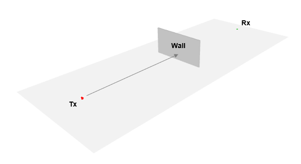
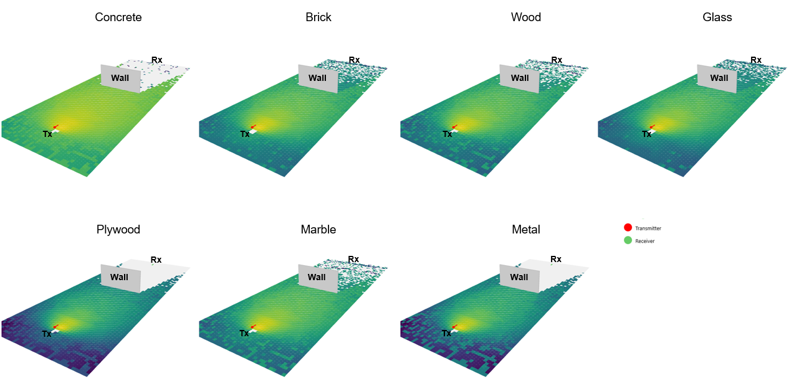
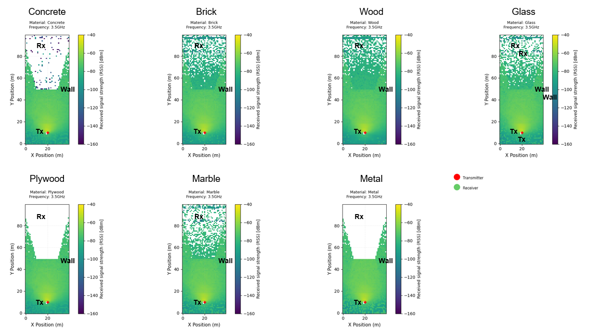
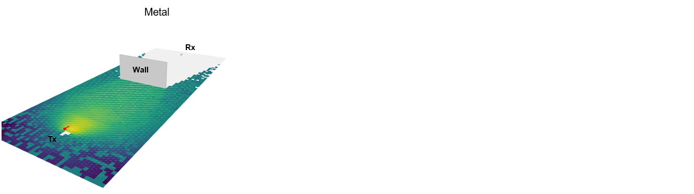
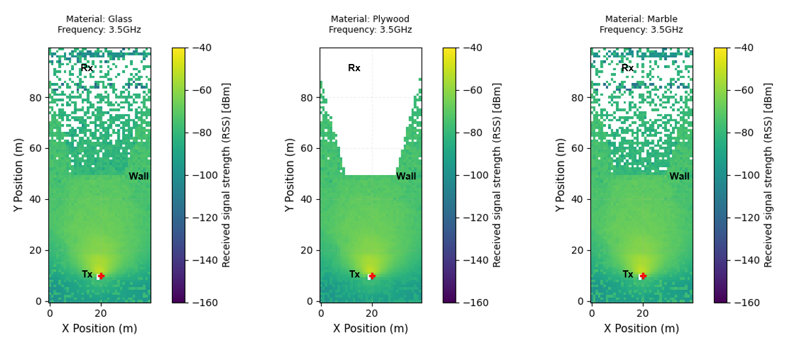

# Blockage-001: Effect of Signal Attenuation Across Different Blocking Materials

## Test Objective

1. Electromagnetic waves interact differently when passing through different materials.

2. In this experiment, the <mark>effect of signal attenuation across different blocking materials</mark> will be simulated. A signal is transmitted from a transmitter to a receiver while the propagation path is blocked by a wall. The wall material is then changed between several common materials such as Concrete, Brick, Glass, and Metal to observe how each material affects signal attenuation.

The figure below shows a simple implementation of the experiment.



!!! info

    [Sionna](https://nvlabs.github.io/sionna/) provides a list of materials for propagation simulation in its toolkit, called [Radio Materials](https://nvlabs.github.io/sionna/rt/api/radio_materials.html). Each material has different electromagnetic properties, such as permittivity and conductivity, which affect signal propagation.

## Results

The figures below show that the transmitted signal is shadowed by the wall. Different wall materials produce different blockage effects on signal attenuation. <mark>Materials such as Concrete, Plywood, and Metal cause higher attenuation compared to the other materials.</mark>







!!! warning

    Plot generated using [scene.preview](https://nvlabs.github.io/sionna/rt/api/scene.html#sionna.rt.Scene.preview), and the RSS legend colors were not set. Refer to the next result plot to view the RSS with the legend colors limit defined.

From the top-view [Radio Map](https://nvlabs.github.io/sionna/rt/api/radio_maps.html), it can be observed that signals barely reach the receiver when using Concrete, Plywood, and Metal walls. Other materials also affect the signal strength, but most signals are still able to reach the receiver.





In [Sionna](https://nvlabs.github.io/sionna/), the received signal strength (RSS) for each propagation path can also be calculated. As shown from generated results below, <mark>some signal paths are still able to reach the receiver through Concrete, but the RSS is very low. For Metal and Plywood, no signal propagation paths are able to reach the receiver.</mark>

```markdown
Result:

Material: Concrete, RSS = [-121.75293] dBm
Material: Brick, RSS = [-91.96423] dBm
Material: Wood, RSS = [-79.30871] dBm
Material: Glass, RSS = [-87.17416] dBm
No paths for Plywood
Material: Marble, RSS = [-79.04089] dBm
No paths for Metal
```

## Simulation Settings

Run code from [source](https://github.com/zulfadlizainal/sionna-results/tree/main/src) ⬇️

<details>
  <summary>Parameters</summary>

```markdown
Map Layout = 40 x 100 m
Tx Antenna Pattern = "tr38901"
Tx Power = 0 dBm
Rx Antenna Pattern = "iso"
Carrie Frequency = 3.5 GHz
Wall Thickness = 20 cm
```

</details>

<details>
  <summary>Code</summary>

```python
# Import libraries
import numpy as np
from sionna.rt import load_scene, ITURadioMaterial, Transmitter, Receiver, PlanarArray, RadioMapSolver, PathSolver
import matplotlib.pyplot as plt

# Import scene from blender mitsuba export (.xml)
scene = load_scene("wall.xml")

# Add array for both Tx and Rx to scene
scene.tx_array = PlanarArray(num_rows=1, 
                             num_cols=1,
                             vertical_spacing=0.5,
                             horizontal_spacing=0.5,
                             pattern="tr38901",
                             polarization="V")

scene.rx_array = PlanarArray(num_rows=1, 
                             num_cols=1,
                             vertical_spacing=0.5,
                             horizontal_spacing=0.5,
                             pattern="iso",
                             polarization="V")

# Add frequency to scene
carrier_freq = 3.5e9 # In Hz
scene.frequency = carrier_freq

# Add material to scene
scene.add(ITURadioMaterial(
    name="Concrete",
    itu_type="concrete",
    thickness=0.2
))

scene.add(ITURadioMaterial(
    name="Brick",
    itu_type="brick",
    thickness=0.2
))

scene.add(ITURadioMaterial(
    name="Wood",
    itu_type="wood",
    thickness=0.2
))

scene.add(ITURadioMaterial(
    name="Glass",
    itu_type="glass",
    thickness=0.2
))

scene.add(ITURadioMaterial(
    name="Plywood",
    itu_type="plywood",
    thickness=0.2
))

scene.add(ITURadioMaterial(
    name="Marble",
    itu_type="marble",
    thickness=0.2
))

scene.add(ITURadioMaterial(
    name="Metal",
    itu_type="metal",
    thickness=0.2
))

materials = [
    "Concrete",
    "Brick",
    "Wood",
    "Glass",
    "Plywood",
    "Marble",
    "Metal"
]

# Check if all material can be swapped for the wall
for m in materials:
    scene.objects["Cube"].radio_material = m
    print("Check:", m)

# Check current material in the scene
print(f"Radio Materials in scene: {list(scene.radio_materials.keys())}")

# Deploy Tx and Rx location
tx = Transmitter("tx", [0, -40, 1.5], [0, 0,0], power_dbm=0)
rx = Receiver("rx", [0, 40, 1.5], [0, 0, 0])

# Point Tx and Rx towards each other
tx.look_at(rx.position)
rx.look_at(tx.position)

# Add Tx and Rx to the scene
scene.add(tx)
scene.add(rx)

# Generate radio map
rm_solver = RadioMapSolver()

for m in materials:

    scene.objects["Cube"].radio_material = m
    print("Material:", m)

    rm = rm_solver(
        scene,
        max_depth=10,
        samples_per_tx=10**7,
        cell_size=(1, 1),
        center=[0, 0, 0],
        size=[40, 100],
        orientation=[0, 0, 0]
    )

    plt.figure(figsize=(8, 10))

    # Show radio map
    rm.show(metric="rss")

    plt.title(
        f"Material: {m}\n"
        f"Frequency: {carrier_freq/1e9}GHz",
        fontsize=9,
        pad=15
    )

    plt.xlabel("X Position (m)", fontsize=11)
    plt.ylabel("Y Position (m)", fontsize=11)
    plt.clim(-160, -40)
    plt.grid(
        alpha=0.2,
        linestyle="--"
    )
    plt.tight_layout()
    plt.show()

# Generate paths
p_solver = PathSolver()

for m in materials:

    scene.objects["Cube"].radio_material = m

    paths = p_solver(
        scene,
        max_depth=10,
        samples_per_src=10**6
    )

    # Extract path coeficients (amplitude + phase)
    a = paths.a[0].numpy().flatten()

    # Convert path to power
    power = np.abs(a)**2 # Power = V squared or I squared assumed if R is 0

    # Skip material that does not have any path (received power = 0)
    if power.size == 0:
        print(f"No paths for {m}")
        continue

    # Generate Received Signal Strength (RSS)
    rss = 10 * np.log10(np.sum(power)) + tx.power_dbm

    print(f"Material: {m}, RSS = {rss} dBm")
```

</details>
