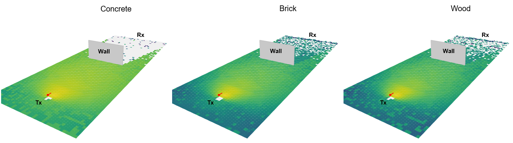
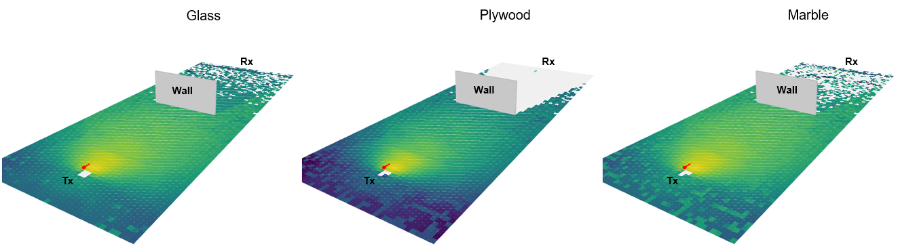
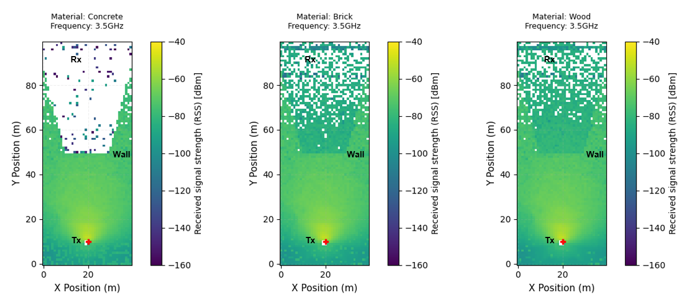
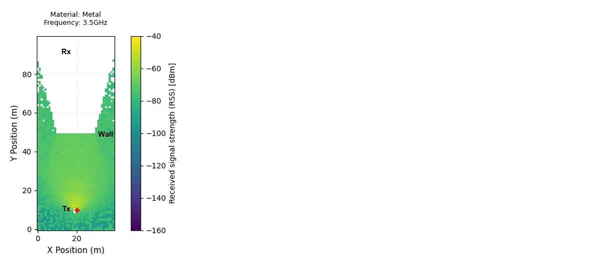

# Blockage-001: Effect of Signal Attenuation Across Different Blocking Materials

## Test Description

<!-- Objective and Hypothesis and Expected Output-->

This experiment is to test the effect of blockage on an electromagnetic signal using different major blockage materials in a normal environment. Depending on the material that blocks the signal, the effect of the attenuation is expected to be different. The effect of signal attenuation will be measured at the receiver located beyond the blocking material. The shadowing effect of the signal will also be verified in a 3D render to provide a better view of the blockage.

!!! example "Variables in this test"

    Blockage materials: Concrete, Brick, Wood, Glass, Plywood, Marble, and Metal. Each material has its own specifications in terms of conductivity, permittivity, and frequency ranges defined by ITU. [Sionna](https://nvlabs.github.io/sionna/) enables these [ITU Radio Materials](https://nvlabs.github.io/sionna/rt/api/radio_materials.html) to be imported directly from the Sionna library.

<!-- Test Scenario -->

In this test, two devices, Tx and Rx, were placed facing each other. In between them, a wall was placed for the purpose of blocking the transmitted signal. The Received Signal Strength ([RSS](https://nvlabs.github.io/sionna/rt/api/radio_maps.html#sionna.rt.RadioMap.rss)) beyond the wall will be evaluated to understand the effect of signal attenuation. The surrounding environment is kept open with no walls to eliminate any effects of signal reflections.


!!! quote "Constants"

    ```python
    Carrier Frequency = 3.5 GHz
    Simulation Area = 40 x 100 m
    Wall Thickness = 20 cm
    Tx Antenna Pattern = tr38901
    Tx Power = 0 dBm
    Rx Antenna Pattern = iso
    Distance between Tx and Rx = 80 m
    Tx Orientation = Towards Rx
    Rx Orientation = Towards Tx
    ```

## Results

<!-- Result Discussion -->

#### Result 1: Shadowing Effect through 3D Radio Map

Below is the result of RSS [3D Radio Map](https://nvlabs.github.io/sionna/rt/tutorials/Introduction.html#Radio-Maps) in dBm generated through [Scene.preview()](https://nvlabs.github.io/sionna/rt/api/scene.html#sionna.rt.Scene.preview) function in Sionna. It can be observed that different blockage materials could have different effects on the attenuation of the electromagnetic signal. Materials like Concrete, Plywood, and Metal can be seen effectively blocking the signal from arriving at the receiver.






!!! warning "RSS Color Legend"

    Plot generated using [Scene.preview()](https://nvlabs.github.io/sionna/rt/api/scene.html#sionna.rt.Scene.preview), and the RSS legend colors were not set. Refer to the next result plot to view the RSS with the legend color limits defined.

#### Result 2: Shadowing Effect through 2D Radio Map

The 3D Radio Map can also be generated in a [2D Radio Map](https://nvlabs.github.io/sionna/rt/tutorials/Radio-Maps.html) top view. It can be observed that signals barely reach the receiver when using Concrete, Plywood, and Metal as blockage materials for the wall. Other materials also affect the signal strength, but most signals are still able to reach the receiver.






#### Result 3: Received Signal Strength in Receiver

In Sionna, the RSS for each propagation path can also be calculated through the [Paths.a](https://nvlabs.github.io/sionna/rt/api/paths.html#sionna.rt.Paths.a) property. As shown from the generated results below, some signal paths are still able to reach the receiver through Concrete, but the RSS is very low. For Metal and Plywood, no signal propagation paths are able to reach the receiver.

```python
Result:

Material: Concrete, RSS = [-121.75293] dBm
Material: Brick, RSS = [-91.96423] dBm
Material: Wood, RSS = [-79.30871] dBm
Material: Glass, RSS = [-87.17416] dBm
No paths for Plywood
Material: Marble, RSS = [-79.04089] dBm
No paths for Metal
```

#### Key Takeaway

1. Based on these results, it can be concluded that the material attenuation ranking from highest to lowest is: Metal/Plywood > Concrete > Brick > Glass > Wood/Marble

## Source Code

Regenerate the results from [source](https://github.com/zulfadlizainal/sionna-results/tree/main/src) ⬇️

<details>
  <summary>Python</summary>

```python
# Import libraries
import numpy as np
from sionna.rt import load_scene, ITURadioMaterial, Transmitter, Receiver, PlanarArray, RadioMapSolver, PathSolver
import matplotlib.pyplot as plt

# Import scene from blender mitsuba export (.xml)
scene = load_scene("blender-assets/wall.xml")

# Add array for both Tx and Rx to scene
scene.tx_array = PlanarArray(num_rows=1, 
                             num_cols=1,
                             vertical_spacing=0.5,
                             horizontal_spacing=0.5,
                             pattern="tr38901",
                             polarization="V")

scene.rx_array = PlanarArray(num_rows=1, 
                             num_cols=1,
                             vertical_spacing=0.5,
                             horizontal_spacing=0.5,
                             pattern="iso",
                             polarization="V")

# Add frequency to scene
carrier_freq = 3.5e9 # In Hz
scene.frequency = carrier_freq

# Add material to scene
scene.add(ITURadioMaterial(
    name="Concrete",
    itu_type="concrete",
    thickness=0.2
))

scene.add(ITURadioMaterial(
    name="Brick",
    itu_type="brick",
    thickness=0.2
))

scene.add(ITURadioMaterial(
    name="Wood",
    itu_type="wood",
    thickness=0.2
))

scene.add(ITURadioMaterial(
    name="Glass",
    itu_type="glass",
    thickness=0.2
))

scene.add(ITURadioMaterial(
    name="Plywood",
    itu_type="plywood",
    thickness=0.2
))

scene.add(ITURadioMaterial(
    name="Marble",
    itu_type="marble",
    thickness=0.2
))

scene.add(ITURadioMaterial(
    name="Metal",
    itu_type="metal",
    thickness=0.2
))

materials = [
    "Concrete",
    "Brick",
    "Wood",
    "Glass",
    "Plywood",
    "Marble",
    "Metal"
]

# Check if all material can be swapped for the wall
for m in materials:
    scene.objects["Cube"].radio_material = m
    print("Check:", m)

# Check current material in the scene
print(f"Radio Materials in scene: {list(scene.radio_materials.keys())}")

# Deploy Tx and Rx location
tx = Transmitter("tx", [0, -40, 1.5], [0, 0,0], power_dbm=0)
rx = Receiver("rx", [0, 40, 1.5], [0, 0, 0])

# Point Tx and Rx towards each other
tx.look_at(rx.position)
rx.look_at(tx.position)

# Add Tx and Rx to the scene
scene.add(tx)
scene.add(rx)

# Generate radio map
rm_solver = RadioMapSolver()

for m in materials:

    scene.objects["Cube"].radio_material = m
    print("Material:", m)

    rm = rm_solver(
        scene,
        max_depth=10,
        samples_per_tx=10**7,
        cell_size=(1, 1),
        center=[0, 0, 0],
        size=[40, 100],
        orientation=[0, 0, 0]
    )

    plt.figure(figsize=(8, 10))

    # Show radio map
    rm.show(metric="rss")

    plt.title(
        f"Material: {m}\n"
        f"Frequency: {carrier_freq/1e9}GHz",
        fontsize=9,
        pad=15
    )

    plt.xlabel("X Position (m)", fontsize=11)
    plt.ylabel("Y Position (m)", fontsize=11)
    plt.clim(-160, -40)
    plt.grid(
        alpha=0.2,
        linestyle="--"
    )
    plt.tight_layout()
    plt.show()

# Generate paths
p_solver = PathSolver()

for m in materials:

    scene.objects["Cube"].radio_material = m

    paths = p_solver(
        scene,
        max_depth=10,
        samples_per_src=10**6
    )

    # Extract path coeficients (amplitude + phase)
    a = paths.a[0].numpy().flatten()

    # Convert path to power
    power = np.abs(a)**2 # Power = V squared or I squared assumed if R is 0

    # Skip material that does not have any path (received power = 0)
    if power.size == 0:
        print(f"No paths for {m}")
        continue

    # Generate Received Signal Strength (RSS)
    rss = 10 * np.log10(np.sum(power)) + tx.power_dbm

    print(f"Material: {m}, RSS = {rss} dBm")
```

</details>
