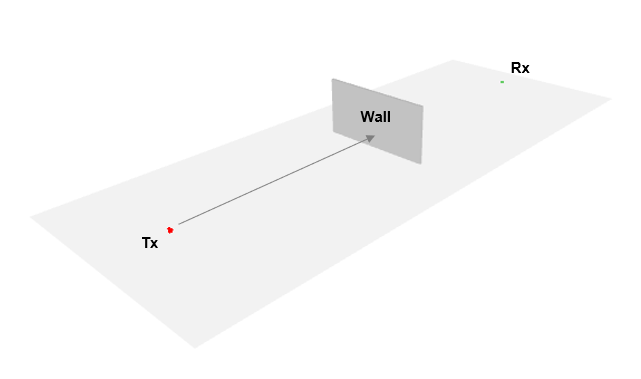
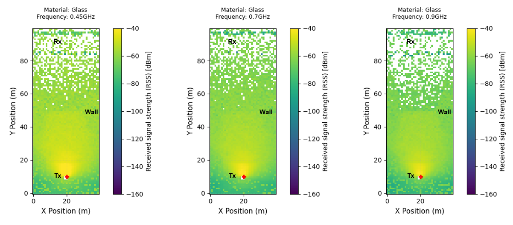
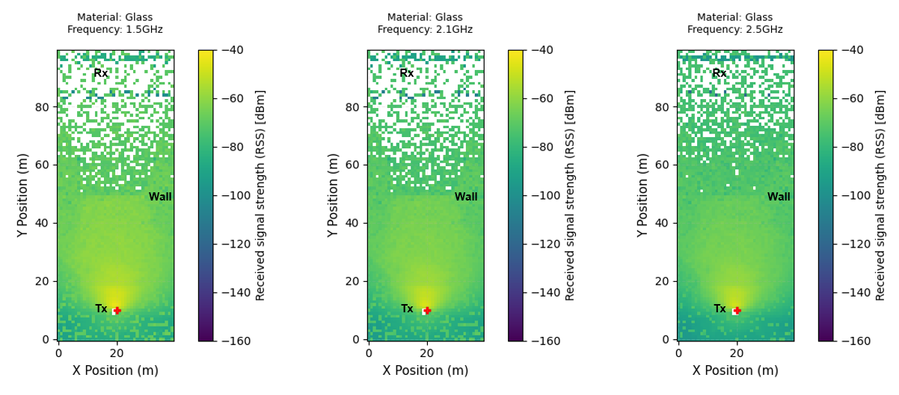
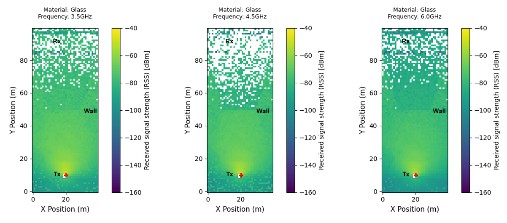
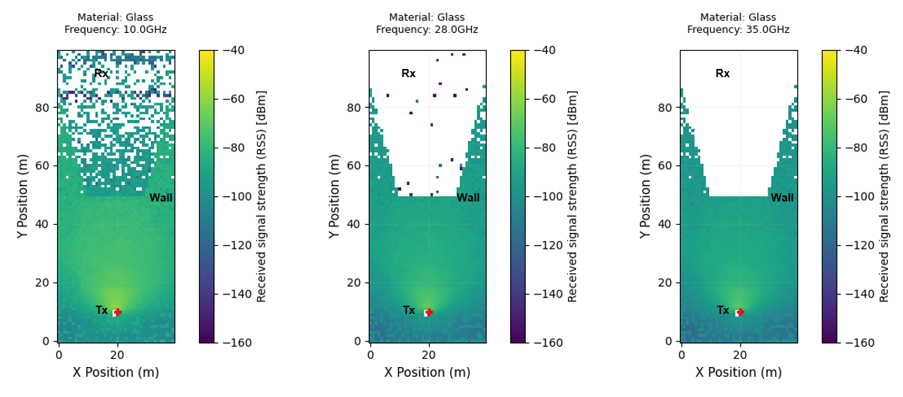
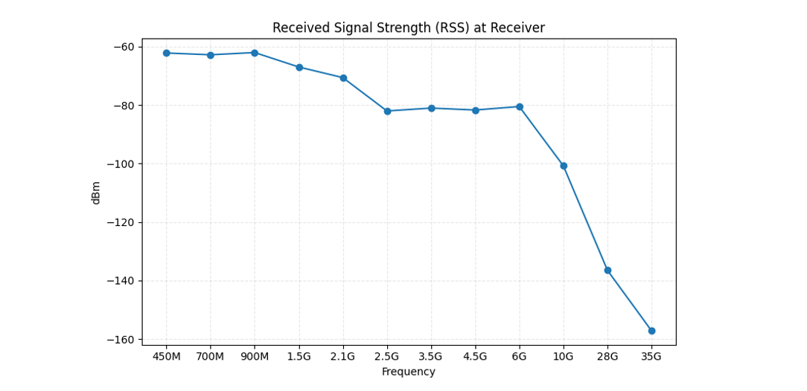

# Blockage-002: Effect of Signal Attenuation at Different Frequencies Through a Blockage

## Test Description

This experiment is to <mark>test the effect of blockage on an electromagnetic signal at different carrier frequencies</mark>. Depending on the transmitted carrier frequency, the effect of the attenuation is expected to be different. The effect of signal attenuation will be measured at the receiver located beyond the blocking material.

<!-- Objective and Hypothesis and Expected Output-->

!!! example "Variables in this test"

    <mark>Carrier Frequencies: 450M, 700M, 900M, 1.5G, 2.1G, 2.5G, 3.5G, 4.5G, 6G, 10G, 28G, 35G in Hz</mark>. The list of frequencies is decided based on [common frequency ranges deployed in 5G](https://www.rfwireless-world.com/terminology/5g-nr-frequency-bands-fr1-fr2). Frequencies <= 6G are used to represent FR1 Sub-6 frequencies, while frequencies >= 25G are used to represent FR2 mmWave frequencies.

<!-- Test Scenario -->

In this test, two devices, Tx and Rx, were placed facing each other. In between them, a wall was placed for the purpose of blocking the transmitted signal. <mark>Glass was chosen as the wall material to run the experiment because it covers a wide range of carrier frequencies</mark> based on the [ITU Radio Materials](https://nvlabs.github.io/sionna/rt/api/radio_materials.html). The Received Signal Strength ([RSS](https://nvlabs.github.io/sionna/rt/api/radio_maps.html#sionna.rt.RadioMap.rss)) before and beyond the wall will be evaluated to understand the effect of signal attenuation. The surrounding environment is kept open with no walls to eliminate any effects of signal reflections.



!!! quote "Constants"

    ```python
    Simulation Area = 40 x 100 m2
    Wall Blockage Material = Glass
    Wall Thickness = 10 cm
    Tx Antenna Pattern = tr38901
    Tx Power = 0 dBm
    Rx Antenna Pattern = iso
    Distance between Tx and Rx = 80 m
    Tx Orientation = Towards Rx
    Rx Orientation = Towards Tx
    ```

## Results

<!-- Result Discussion -->

#### Result 1: Shadowing Effect through 2D Radio Map

From a [2D Radio Map](https://nvlabs.github.io/sionna/rt/tutorials/Radio-Maps.html), it can be seen that <mark>signals beyond the wall attenuate much more as the frequency increases.</mark> This effect is much more noticeable in mmWave frequencies (e.g. 28G, 35G Hz). Not only do signals beyond the wall attenuate more, but <mark>free-space propagation for signals before reaching the wall also attenuates much more as the frequency increases</mark>.









#### Result 2: Received Signal Strength at the Receiver

In [Sionna](https://nvlabs.github.io/sionna/), the RSS for each propagation path can also be calculated through the [Paths.a](https://nvlabs.github.io/sionna/rt/api/paths.html#sionna.rt.Paths.a) property. As shown from the generated results below, the receiver is able to receive at least a single signal path from the transmitter. It can be observed that <mark>the larger the carrier frequency, the higher the attenuation beyond the wall blockage.</mark>

```python
Result:

Frequency: 450M, RSS = [-62.171818] dBm
Frequency: 700M, RSS = [-62.77891] dBm
Frequency: 900M, RSS = [-62.008064] dBm
Frequency: 1.5G, RSS = [-66.966896] dBm
Frequency: 2.1G, RSS = [-70.58682] dBm
Frequency: 2.5G, RSS = [-82.00487] dBm
Frequency: 3.5G, RSS = [-81.01307] dBm
Frequency: 4.5G, RSS = [-81.67861] dBm
Frequency: 6G, RSS = [-80.48494] dBm
Frequency: 10G, RSS = [-100.747215] dBm
Frequency: 28G, RSS = [-136.49324] dBm
Frequency: 35G, RSS = [-157.17908] dBm
```

There is <mark>observable degradation in RSS at mmWave frequencies</mark> compared to other Sub-6 frequencies.



#### Key Takeaway

1. The <mark>higher the carrier frequency, the higher the impact of signal attenuation</mark> due to blockage
2. Even during free-space propagation before reaching the wall, signals attenuate more at higher frequencies
3. <mark>mmWave frequencies are very sensitive to blockage</mark>, even for see-through materials like Glass

## Source Code

Regenerate the results from [source](https://github.com/zulfadlizainal/sionna-results/tree/main/src) ⬇️

<details>
  <summary>python</summary>

```python
# Import libraries
import numpy as np
from sionna.rt import load_scene, ITURadioMaterial, Transmitter, Receiver, PlanarArray, RadioMapSolver, PathSolver
import matplotlib.pyplot as plt

# Import scene from blender mitsuba export (.xml)
scene = load_scene("blender-assets/wall.xml")

# Add array for both Tx and Rx to scene
scene.tx_array = PlanarArray(num_rows=1, 
                             num_cols=1,
                             vertical_spacing=0.5,
                             horizontal_spacing=0.5,
                             pattern="tr38901",
                             polarization="V")

scene.rx_array = PlanarArray(num_rows=1, 
                             num_cols=1,
                             vertical_spacing=0.5,
                             horizontal_spacing=0.5,
                             pattern="iso",
                             polarization="V")

# Add material to scene
scene.add(ITURadioMaterial(
    name="Glass",
    itu_type="glass",
    thickness=0.1
))

# Apply material to wall and plane object
scene.objects["Cube"].radio_material = "Glass"
scene.objects["Plane"].radio_material = "Glass"

scene.remove("itu-very_dry_ground")
scene.remove("itu-concrete")

# Check current material in the scene
print(f"Radio Materials in scene: {list(scene.radio_materials.keys())}")

# Deploy Tx and Rx location
tx = Transmitter("tx", [0, -40, 1.5], [0, 0,0], power_dbm=0)
rx = Receiver("rx", [0, 40, 1.5], [0, 0, 0])

# Point Tx and Rx towards each other
tx.look_at(rx.position)
rx.look_at(tx.position)

# Add Tx and Rx to the scene
scene.add(tx)
scene.add(rx)

# Define frequencies to test
frequencies = [
    0.45e9,
    0.7e9,
    0.9e9,
    1.5e9,
    2.1e9,
    2.5e9,
    3.5e9,
    4.5e9,
    6e9,
    10e9,
    28e9,
    35e9,
]

frequency_labels = [
    "450M",
    "700M",
    "900M",
    "1.5G",
    "2.1G",
    "2.5G",
    "3.5G",
    "4.5G",
    "6G",
    "10G",
    "28G",
    "35G"
]

# Generate radio map
rm_solver = RadioMapSolver()

for freq, label in zip(frequencies, frequency_labels):

    # Set scene frequency
    scene.frequency = freq

    print(f"\nTesting Frequency: {label}")

    rm = rm_solver(
        scene,
        max_depth=10,
        samples_per_tx=10**7,
        cell_size=(1, 1),
        center=[0, 0, 0],
        size=[40, 100],
        orientation=[0, 0, 0]
    )

    plt.figure(figsize=(8, 10))

    # Show radio map
    rm.show(metric="rss")

    plt.title(
        f"Material: Glass\n"
        f"Frequency: {freq/1e9}GHz",
        fontsize=9,
        pad=15
    )

    plt.xlabel("X Position (m)", fontsize=11)
    plt.ylabel("Y Position (m)", fontsize=11)
    plt.clim(-160, -40)
    plt.grid(
        alpha=0.2,
        linestyle="--"
    )
    plt.tight_layout()
    plt.show()

# Generate paths
p_solver = PathSolver()

rss_results = []

for freq, label in zip(frequencies, frequency_labels):

    scene.frequency = freq

    paths = p_solver(
        scene,
        max_depth=10,
        samples_per_src=10**6
    )

    a = paths.a[0].numpy().flatten()

    power = np.abs(a)**2

    if power.size == 0:
        print(f"No paths for {label}")
        rss_results.append(np.nan)
        continue

    rss = 10 * np.log10(np.sum(power)) + tx.power_dbm

    rss_results.append(rss)

    print(f"Frequency: {label}, RSS = {rss} dBm")

plt.figure(figsize=(8,5))

plt.plot(
    frequency_labels,
    rss_results,
    marker='o'
)

plt.xlabel("Frequency")
plt.ylabel("dBm")
plt.title("Received Signal Strength (RSS) at Receiver")

plt.grid(
    alpha=0.3,
    linestyle="--"
)

plt.tight_layout()
plt.show()
```

</details>
