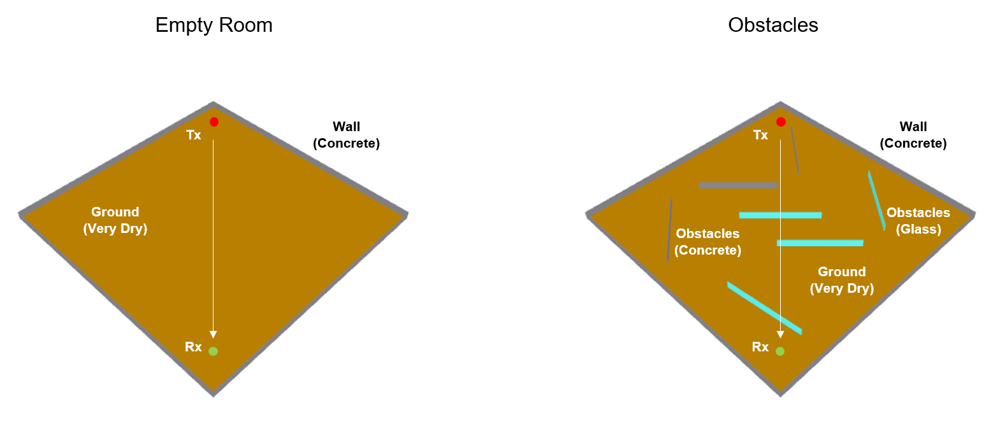
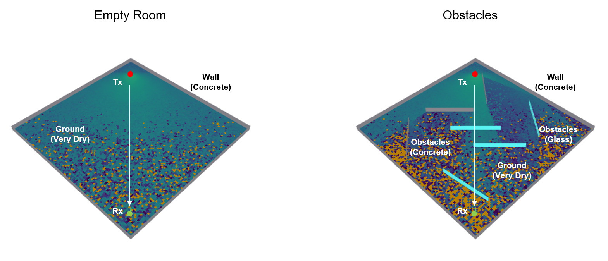
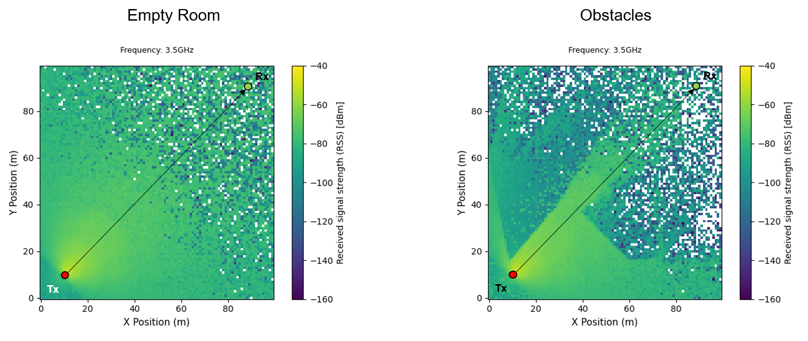
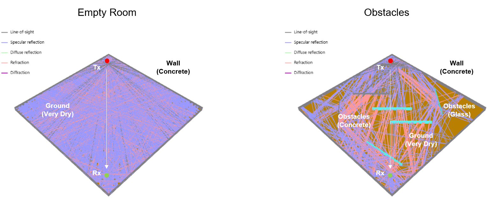
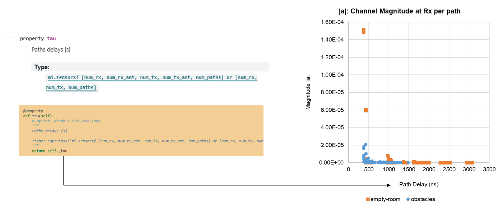
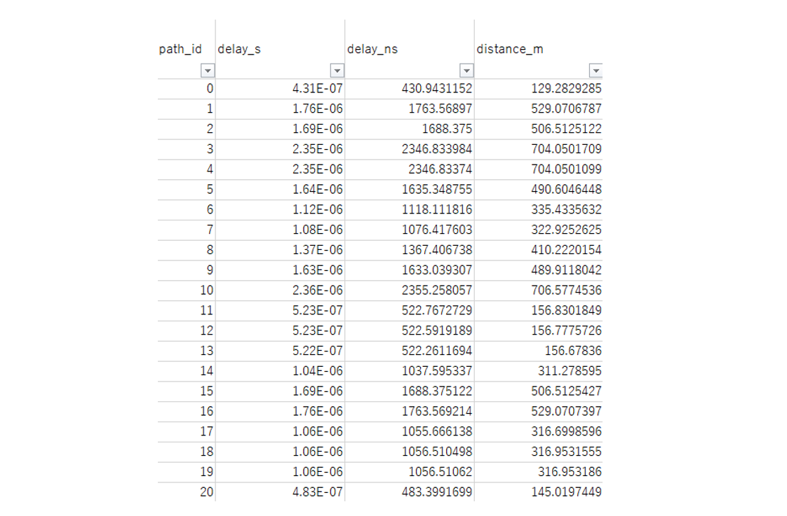
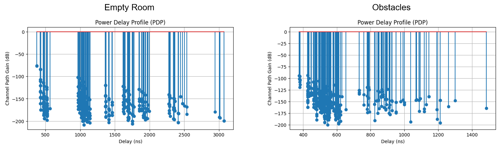

# Multipath-002: Extracting Sionna Paths Delay (tau)

## Test Description

<!-- Objective and Hypothesis and Expected Output -->

The purpose of this experiment is to <mark>extract the Paths Delay ([tau](https://nvlabs.github.io/sionna/rt/api/paths.html#sionna.rt.Paths.tau))</mark> from the [Paths](https://nvlabs.github.io/sionna/rt/api/paths.html#) class in Sionna. The Sionna library provides a list of methods and properties, such as [a](https://nvlabs.github.io/sionna/rt/api/paths.html#sionna.rt.Paths.a) and [tau](https://nvlabs.github.io/sionna/rt/api/paths.html#sionna.rt.Paths.tau), which are convenient for studying multipath propagation. This test attempts to extract those properties.

!!! example "Variables in this test"

    <mark>Environments: Low- and high-obstacle environments</mark>. Different environments introduce different effects on the signal path due to interactions to the environments such as diffraction, reflection, refraction, etc.

<!-- Test Scenario -->

In this test, two devices, Tx and Rx, were placed facing each other in a closed room (without a roof). Two types of scenes were prepared: an empty closed room and a closed room with wall obstacles. The multipath properties generated by Sionna will be examined to identify how the transmitted paths are affected by these two different environments.



!!! quote "Constants"

    ```python
    Carrier Frequency = 3.5 GHz
    Simulation Area = 100 x 100 m
    Outer Wall Thickness = 20 cm
    Inner Obstacles Wall Thickness = 20 cm
    Outer Wall Material = Concrete
    Inner Obstacles Wall Material = Concrete, Glass
    Inner Obstacles Wall Distribution = Random
    Tx Antenna Pattern = tr38901
    Tx Power = 0 dBm
    Rx Antenna Pattern = iso
    Distance between Tx and Rx = 113.14 m
    Tx Orientation = Towards Rx
    Rx Orientation = Towards Tx
    ```

## Results

<!-- Result Discussion -->

#### Result 1: Shadowing Effect through 3D and 2D Radio Maps

Below are the results of the Received Signal Strength ([RSS](https://nvlabs.github.io/sionna/rt/api/radio_maps.html#sionna.rt.RadioMap.rss)) in two different scene environments: an empty room and a room with obstacles. The RSS in the empty room shows much better readings compared to the room with obstacles. <mark>Rooms with obstacles generate a highly attenuated environment where signals are heavily shadowed by the obstacles</mark>.





!!! warning "RSS Color Legend"

    The 3D Radio Map plot is generated using [Scene.preview()](https://nvlabs.github.io/sionna/rt/api/scene.html#sionna.rt.Scene.preview), and the RSS legend colors were not set. Relatively, the values should be similar to those in the 2D Radio Map.

#### Result 2: Preview of 3D Multipath Scene

Just like the [RadioMapSolver](https://nvlabs.github.io/sionna/rt/api/radio_map_solvers.html) class in Sionna, the [PathSolver](https://nvlabs.github.io/sionna/rt/api/paths_solvers.html#sionna.rt.PathSolver) class allows users to view the scene of each signal path transmitted from the Tx. From this, users can visualize the interactions of each signal path with the environment in 3D—whether it is reflected, refracted, diffracted, etc.

From the results, it can be seen that the <mark>empty room mostly has reflection-type path interactions due to its LOS environment, where the paths are only reflected from the outer walls. In contrast, in the room with obstacles, multiple types of signal path interactions can be observed more prominently</mark>.



!!! note "Interactions"

    [InteractionType](https://nvlabs.github.io/sionna/rt/api/paths.html#sionna.rt.constants.InteractionType) can be counted in Sionna and will be studied more thoroughly in future experiments.

#### Result 3: Paths Delay (tau) for Each Signal Path

The <mark>Paths Delay ([tau](https://nvlabs.github.io/sionna/rt/api/paths.html#sionna.rt.Paths.tau)) property in Sionna provides the delay of each path separately in seconds</mark>.



Each signal path has an ID. From the extracted delay (tau), other meaningful quantities can be derived, such as delay in nanoseconds and free-space path distance.



#### Result 4: Power Delay Profile (PDP)

In practice, the Power Delay Profile (PDP) is often used to evaluate multipath channel path gains based on their respective path delays. The channel path gain can be calculated according to this [reference](Multipath/Multipath-001).

In the result below, it can be seen that the empty room has a higher channel path gain for its fastest path compared to the room with obstacles due to its LOS environment. <mark>The fastest path also has a higher channel path gain compared to other slower paths</mark>. The profile or pattern of multipath grouping can also be studied through this stem chart.



#### Key Takeaways

1. Sionna is able to generate <mark>each signal path transmitted from Tx to Rx, and all of its interactions with the environment can be visualized</mark> in a 3D scene.
2. Paths Delay (tau) for each <mark>signal path can be extracted along with its path ID</mark>.
3. Other meaningful quantities, such as <mark>path distance, can be calculated from the Paths Delay (tau)</mark>.
4. <mark>The fastest path also has a higher channel path gain compared to other slower paths</mark>.

## Source Code

Regenerate the results from [source](https://github.com/zulfadlizainal/sionna-results/tree/main/src) ⬇️

<details>
  <summary>Python</summary>

```python
# Import libraries
import numpy as np
from sionna.rt import load_scene, ITURadioMaterial, Transmitter, Receiver, PlanarArray, RadioMapSolver, PathSolver
import matplotlib.pyplot as plt
import pandas as pd

# Import scene from blender mitsuba export (.xml)
scene = load_scene("blender-assets/empty-room/emptyroom-100x100m.xml")
# scene = load_scene("blender-assets/obstacle-room/obstacleroom-100x100m.xml")

# Check objects in the scene
print("Check Scene Objects:")
print(f"Objects in scene: {list(scene.objects.keys())}")
print(f"Radio Materials in scene: {list(scene.radio_materials.keys())}")

# Add array for both Tx and Rx to scene
scene.tx_array = PlanarArray(num_rows=1, 
                             num_cols=1,
                             vertical_spacing=0.5,
                             horizontal_spacing=0.5,
                             pattern="tr38901",
                             polarization="V")

scene.rx_array = PlanarArray(num_rows=1, 
                             num_cols=1,
                             vertical_spacing=0.5,
                             horizontal_spacing=0.5,
                             pattern="iso",
                             polarization="V")

# Add frequency to scene
carrier_freq = 3.5e9 # In Hz
scene.frequency = carrier_freq

# Deploy Tx and Rx location
tx = Transmitter("tx", [-40, -40, 1.5], [0, 0,0], power_dbm=0)
tx_power_dbm = tx.power_dbm[0]
rx = Receiver("rx", [40, 40, 1.5], [0, 0, 0])

# Point Tx and Rx towards each other
tx.look_at(rx.position)
rx.look_at(tx.position)

# Add Tx and Rx to the scene
scene.add(tx)
scene.add(rx)

# Plot 2D Radio Map
rm_solver = RadioMapSolver()

rm = rm_solver(
    scene,
    max_depth=10,
    samples_per_tx=10**7,
    cell_size=(1, 1),
    center=[0, 0, 0],
    size=[100, 100],
    orientation=[0, 0, 0]
)

plt.figure(figsize=(8, 10))

# Show radio map
rm.show(metric="rss")

plt.title(
    f"Frequency: {carrier_freq/1e9}GHz",
    fontsize=9,
    pad=15
)
plt.xlabel("X Position (m)", fontsize=11)
plt.ylabel("Y Position (m)", fontsize=11)
plt.clim(-160, -40)
plt.grid(
    alpha=0.2,
    linestyle="--"
)
plt.tight_layout()
plt.show()

# Study multipath property
# Run path solver
p_solver = PathSolver()

paths = p_solver(
    scene,
    max_depth=10,
    samples_per_src=10**6
)

# Extract path coefficients (a function return 2 components: a_real, a_imag)
a_real, a_imag = paths.a
a_real = a_real.numpy()
a_imag = a_imag.numpy()

# Reconstruct complex channel coefficients in real and imaginary form
a = a_real + 1j * a_imag

# Optional - Extract path delays [num_rx, num_tx, num_paths]
tau = paths.tau
if isinstance(tau, tuple):
    tau = tau[0]
tau = tau.numpy()

# a shape should return [num_rx, num_rx_ant, num_tx, num_tx_ant, num_paths]
# tau shape should return [num_rx, num_tx, num_paths]
# print("\nCheck a and tau shape:")
# print("a shape:", a.shape)
# print("tau shape:", tau.shape)

# Check total number of paths
num_paths = a.shape[-1]
print(f"\nTotal paths found: {num_paths}")

# Combine multipath properties into dataframe
path_data = []

for i in range(num_paths):

    # Get channel coefficient (real + imaginary) one by one
    a_coeff = a[0, 0, 0, 0, i]

    # Extract real and imaginary components
    real_coeff = np.real(a_coeff)
    imag_coeff = np.imag(a_coeff)

    # Magnitude and phase
    magnitude = np.abs(a_coeff) 
    phase_rad = np.angle(a_coeff) 

    # Example

    # Magnitude |h| = sqrt (r**2 + i**2) - Distance from center 0,0
    # Phase φ = atan2(i/r) - Degree from 0,0

    # Imaginary (Q)
    # ^
    # |
    # |        *
    # |      (3,4)
    # |
    # +-----------------> Real (I)

    # Channel Gain
    channel_path_gain = magnitude**2
    channel_path_gain_db = 10*np.log10(channel_path_gain)

    # Optional - Delay
    delay_s = tau[0, 0, i]
    delay_ns = delay_s * 1e9

    # Optional - Equivalent propagation distance (Free space)
    distance_m = delay_s * 3e8

    path_data.append({
        "path_id": i,
        "delay_s": float(delay_s),
        "delay_ns": float(delay_ns),
        "distance_m": float(distance_m),

        "real_coeff": float(real_coeff),
        "imag_coeff": float(imag_coeff),

        "magnitude": float(magnitude),
        "phase_rad": float(phase_rad),
        "phase_deg": float(np.degrees(phase_rad)),

        "channel_path_gain": float(channel_path_gain),
        "channel_path_gain_db": float(channel_path_gain_db),
    })

# Put array in Dataframe
df_paths = pd.DataFrame(path_data)

# Calculate Received Signal Strength (RSS) at Receivers 

# Non Coherent Case (Just a sum of power in Rx)
total_channel_path_gain = 10*np.log10(df_paths['channel_path_gain'].sum())
rss_non_coherent = tx_power_dbm+total_channel_path_gain

# Coherent Case (Consider constructive & destructive effect caused by phase delay in Rx)
total_real = df_paths['real_coeff'].sum()
total_imag = df_paths['imag_coeff'].sum()
total_magnitude = np.sqrt(total_real**2 + total_imag**2)
total_channel_path_gain = 10*np.log10(total_magnitude**2)
rss_coherent = tx_power_dbm+total_channel_path_gain

# More simpler coherent calculation

# a_coeff = np.sum(a[0,0,0,0,:])
# total_channel_path_gain = 10*np.log10(np.abs(a_coeff)**2)
# rss_coherent = tx_power_dbm+total_channel_path_gain

print(f"\nRSS at Receiver:")
print(f"RSS (Non Coherent Case): {rss_non_coherent} dBm")
print(f"RSS (Coherent Case): {rss_coherent} dBm")
print(f"Delta: {rss_non_coherent-rss_coherent} dB")

# Export CSV
df_paths.to_csv("output/multipath_paths_list_empty-room.csv", index=False)

# # Optional - Power Delay Profile (PDP)
# plt.figure(figsize=(8,4))
# plt.stem(df_paths["delay_ns"], df_paths["channel_path_gain_db"])
# plt.xlabel("Delay (ns)")
# plt.ylabel("Channel Path Gain (dB)")
# plt.title("Power Delay Profile (PDP)")
# plt.grid(True)
# plt.show()

# # Optional - I-Q Plot
# plt.figure(figsize=(6,6))
# plt.scatter(
#     df_paths["real_coeff"],
#     df_paths["imag_coeff"]
# )
# plt.xlabel("Real")
# plt.ylabel("Imag")
# plt.title("Multipath Channel Coefficients")
# plt.grid(True)
# plt.axis("equal")
# plt.show()

# # Optional - Delay vs Magnitude
# plt.figure(figsize=(8,4))
# plt.scatter(
#     df_paths["delay_ns"],
#     df_paths["magnitude"]
# )
# plt.xlabel("Delay (ns)")
# plt.ylabel("|a|")
# plt.title("Delay vs Channel Magnitude")
# plt.grid(True)
# plt.show()

# # Optional - Scene Preview
# scene.preview()

# Optional - Scene Preview (Radio Map)
rm_solver = RadioMapSolver()

rm = rm_solver(
        scene,
        max_depth=10, # Number of maximum interation allowed per paths
        samples_per_tx=10**7, # Number of rays launch in transmitter
        cell_size=(1, 1),
        center=[0, 0, 0],
        size=[100, 100], # Size of area to simulate (meter)
        orientation=[0, 0, 0]
    )

scene.preview(
    radio_map=rm,

    rm_metric="rss",
    rm_db_scale=True,

    rm_vmax = -40,
    rm_vmin = -160,

    show_devices=True,
    show_orientations=True,

    point_picker=False
)

# # Optional - Scene Preview (Paths)
# p_solver = PathSolver()

# paths = p_solver(
#     scene,
#     max_depth=10,
#     samples_per_src=10**6
# )

# scene.preview(
#     paths=paths,

#     show_devices=True,
#     show_orientations=True,

#     point_picker=False
# )
```

</details>
