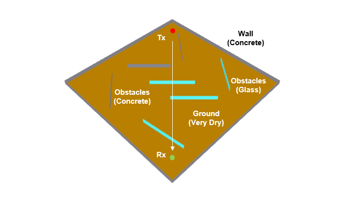
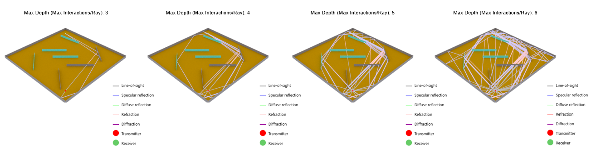
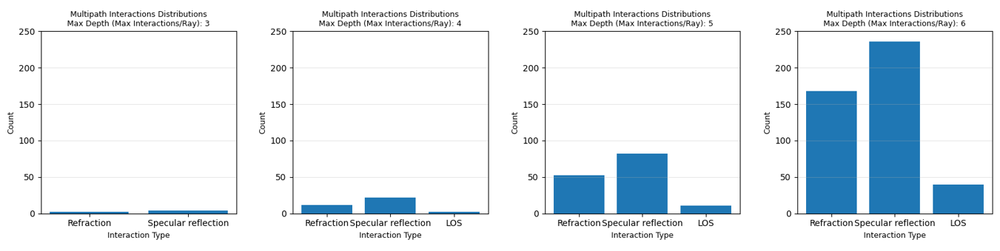
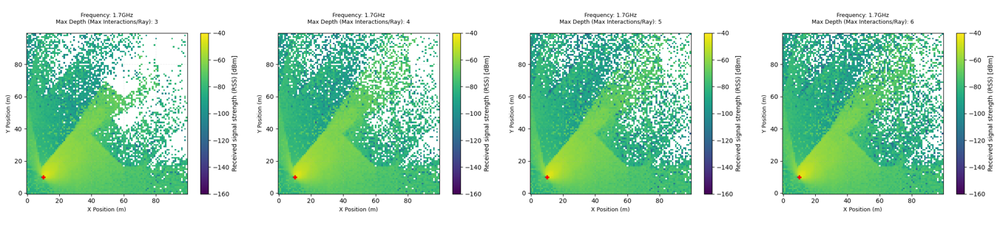
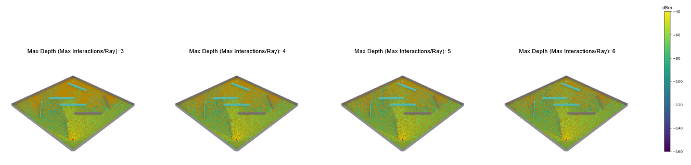

# Multipath-003: Tracing Sionna Ray Paths

## Test Description

<!-- Objective and Hypothesis and Expected Output -->

Since Sionna uses ray tracing to calculate [Radio Maps](https://nvlabs.github.io/sionna/rt/api/radio_maps.html) and [RSS](https://nvlabs.github.io/sionna/rt/api/radio_maps.html#sionna.rt.RadioMap.rss), it is also possible to trace the paths of ray (signal) propagation through its [Scene.preview()](https://nvlabs.github.io/sionna/rt/api/scene.html#sionna.rt.Scene.preview) function. However, this generally becomes difficult because most simulations transmit at least thousands of rays per transmitter, making them hard to track and verify.

In this experiment, the [`max_depth`](https://nvlabs.github.io/sionna/rt/tutorials/Introduction.html?#Ray-tracing-of-Propagation-Paths) parameter, which is available in both the [RadioMapSolver](https://nvlabs.github.io/sionna/rt/api/radio_map_solvers.html) and [PathSolver](https://nvlabs.github.io/sionna/rt/api/paths_solvers.html) classes, will be minimized so that the rays can be traced manually. This allows the way ray interactions with scene objects in Sionna to be better understood.

!!! example "Variables in this test"

    [`max_depth`](https://nvlabs.github.io/sionna/rt/tutorials/Introduction.html?#Ray-tracing-of-Propagation-Paths) parameter: 3, 4, 5, 6. The `max_depth` parameter determines the maximum number of interactions between a ray and scene objects. 

<!-- Test Scenario -->

In this test, two devices, Tx and Rx, were placed facing each other in a closed room (without a roof) containing wall obstacles. The paths of each single ray will be verified visually to understand the way rays interact with scene objects.



!!! quote "Constants"

    ```python
    Carrier Frequency = 1.7 GHz
    Simulation Area = 100 x 100 m
    Outer Wall Thickness = 20 cm
    Inner Obstacles Wall Thickness = 20 cm
    Outer Wall Material = Concrete
    Inner Obstacles Wall Material = Concrete, Glass
    Inner Obstacles Wall Distribution = Random
    Tx Antenna Pattern = tr38901
    Tx Power = 0 dBm
    Rx Antenna Pattern = iso
    Distance between Tx and Rx = 113.14 m
    Tx Orientation = Towards Rx
    Rx Orientation = Towards Tx
    ```

## Results

<!-- Result Discussion -->

#### Result 1: Ray Path Tracing Through 3D Path Scene

In the 3D path results below, generated using the [PathSolver](https://nvlabs.github.io/sionna/rt/api/paths_solvers.html) class and the [Scene.render()](https://nvlabs.github.io/sionna/rt/api/scene.html#sionna.rt.Scene.render) function, it can be seen that minimizing the [`max_depth`](https://nvlabs.github.io/sionna/rt/tutorials/Introduction.html?#Ray-tracing-of-Propagation-Paths) parameter makes the rays easier to track visually. The render only simulates paths whose interactions with scene objects do not exceed the configured `max_depth` parameter. This helps to study the way Sionna categorizes ray interaction types for different scene objects.



!!! info "Types of Interactions in Sionna"

    Sionna introduces five interaction types [Ref](https://nvlabs.github.io/sionna/rt/api/paths.html#sionna.rt.constants.InteractionType).

    | Sionna Attributes | Sionna Definition   | Common Name         |
    |-------------------|---------------------|---------------------|
    | NONE              | No interaction      | Line-of-Sight (LOS) |
    | REFRACTION        | Refraction          | Refraction          |
    | DIFFRACTION       | Diffraction         | Diffraction         |
    | SPECULAR          | Specular reflection | Specular reflection |
    | DIFFUSE           | Diffuse reflection  | Diffuse reflection  |

#### Result 2: Count of Paths vs Interaction Types

Generally, a lower [`max_depth`](https://nvlabs.github.io/sionna/rt/tutorials/Introduction.html?#Ray-tracing-of-Propagation-Paths) generates fewer paths and, indirectly, fewer interaction types.



```python
Result:

max_depth = 3
Total paths found: 2
Total interactions found: 6
↳ Counter({'Specular reflection': 4, 'Refraction': 2})

max_depth = 4
Total paths found: 9
Total interactions found: 36
↳ Counter({'Specular reflection': 22, 'Refraction': 12, 'LOS': 2})

max_depth = 5
Total paths found: 29
Total interactions found: 145
↳ Counter({'Specular reflection': 82, 'Refraction': 52, 'LOS': 11})

max_depth = 6
Total paths found: 74
Total interactions found: 444
↳ Counter({'Specular reflection': 236, 'Refraction': 168, 'LOS': 40})
```

The results show that increasing the `max_depth` parameter significantly increases the number of valid propagation paths discovered by the ray tracer (arrived at receiver). As more ray interactions are allowed, additional reflected and refracted paths can reach the receiver, resulting in a higher path count.

!!! warning "Sionna Line-of-Sight (LOS) Interaction Type"

    Investigate why Sionna reports or renders Line-of-Sight (LOS) interactions for `max_depth = 4`, `5`, and `6`, even though no direct Line-of-Sight (LOS) path is visually observed in the test scenario.

#### Result 3: Effect of Max Depth Settings on RSS Calculations in Radio Maps

When higher `max_depth` values are allowed, more signal propagation paths are considered by the ray tracer during the simulation. Therefore, when generating [Radio Maps](https://nvlabs.github.io/sionna/rt/api/radio_maps.html) for calculations such as [RSS](https://nvlabs.github.io/sionna/rt/api/radio_maps.html#sionna.rt.RadioMap.rss), using more rays generally improves the accuracy of the results. However, this comes at the cost of increased computational complexity, as more ray interactions must be evaluated and included in the calculations.





The radio maps show that increasing the `max_depth` parameter allows signal energy to propagate into areas that would otherwise be unreachable when only a small number of interactions are permitted. As a result, coverage becomes more complete, particularly in regions that rely on reflected or refracted paths rather than direct line-of-sight propagation.

#### Key Takeaways

1. Lower `max_depth` values make ray paths easier to trace and verify visually.

2. Higher `max_depth` values improve RSS accuracy by capturing more multipath propagation effects, but require more computation

## Source Code

Reproduce the results from [source](https://github.com/zulfadlizainal/sionna-results/tree/main/src) ⬇️

<details>
  <summary>Python</summary>

```python
# Import libraries
import numpy as np
from sionna.rt import load_scene, ITURadioMaterial, Transmitter, Receiver, PlanarArray, RadioMapSolver, PathSolver, InteractionType, Camera
import matplotlib.pyplot as plt
import pandas as pd
from collections import Counter

# Import scene from blender mitsuba export (.xml)
scene = load_scene("blender-assets/obstacle-room/obstacleroom-100x100m.xml")

# # Optional - Check objects in the scene
# print("Check Scene Objects:")
# print(f"Objects in scene: {list(scene.objects.keys())}")
# print(f"Radio Materials in scene: {list(scene.radio_materials.keys())}")

# Add array for both Tx and Rx to scene
scene.tx_array = PlanarArray(num_rows=1, 
                             num_cols=1,
                             vertical_spacing=0.5,
                             horizontal_spacing=0.5,
                             pattern="tr38901",
                             polarization="V")

scene.rx_array = PlanarArray(num_rows=1, 
                             num_cols=1,
                             vertical_spacing=0.5,
                             horizontal_spacing=0.5,
                             pattern="iso",
                             polarization="V")

# Add frequency to scene
carrier_freq = 1.7e9 # In Hz
scene.frequency = carrier_freq

# Deploy Tx and Rx location
tx = Transmitter("tx", [-40, -40, 1.5], [0, 0,0], power_dbm=0)
rx = Receiver("rx", [40, 40, 1.5], [0, 0, 0])

# Point Tx and Rx towards each other
tx.look_at(rx.position)
rx.look_at(tx.position)

# Add Tx and Rx to the scene
scene.add(tx)
scene.add(rx)

# Define maximum depth for a single ray (max number of interactions of a single ray to scene objects)
max_depth = 6

# Plot 2D Radio Map
rm_solver = RadioMapSolver()

rm = rm_solver(
    scene,
    max_depth=max_depth,
    samples_per_tx=10**7,
    cell_size=(1, 1),
    center=[0, 0, 0],
    size=[100, 100],
    orientation=[0, 0, 0]
)

plt.figure(figsize=(4, 4))
rm.show(metric="rss")
plt.title(
    f"Frequency: {carrier_freq/1e9}GHz\nMax Depth (Max Interactions/Ray): {max_depth}",
    fontsize=9,
    pad=15
)
plt.xlabel("X Position (m)", fontsize=9)
plt.ylabel("Y Position (m)", fontsize=9)
plt.clim(-160, -40)
plt.grid(
    alpha=0.2,
    linestyle="--"
)
plt.tight_layout()
plt.show()

# Plot 3D radio map
cam = Camera(
position=(-150, -150, 150),
look_at=rx.position
)

scene.render(
    camera=cam,
    radio_map=rm,

    rm_metric="rss",
    rm_vmax = -40,
    rm_vmin = -160,

    rm_show_color_bar=True,

    show_devices=True,
    show_orientations=True
)

# Plot 3D Paths
p_solver = PathSolver()

paths = p_solver(
    scene,
    max_depth=max_depth,
    samples_per_src=10**7
)

cam = Camera(
position=(-150, -150, 150),
look_at=rx.position
)

scene.render(
    camera=cam,
    paths=paths,
)

# Extract path coefficients (a function return 2 components: a_real, a_imag)
a_real, a_imag = paths.a
a_real = a_real.numpy()
a_imag = a_imag.numpy()

# Reconstruct complex channel coefficients in real and imaginary form
a = a_real + 1j * a_imag

# Check total number of paths
num_paths = a.shape[-1]
print(f"\nTotal paths found: {num_paths}")

# Interaction Types
interactions = paths.interactions.numpy()

counts = Counter()

for interaction in interactions.flatten():
    if interaction == InteractionType.NONE:
        counts["LOS"] += 1
    elif interaction == InteractionType.SPECULAR:
        counts["Specular reflection"] += 1
    elif interaction == InteractionType.DIFFUSE:
        counts["Diffuse reflection"] += 1
    elif interaction == InteractionType.REFRACTION:
        counts["Refraction"] += 1
    elif interaction == InteractionType.DIFFRACTION:
        counts["Diffraction"] += 1

print(f"\nTotal interactions found: {sum(counts.values())}")
print(f"\n↳: {counts}")

plt.figure(figsize=(4,4))
plt.bar(
    counts.keys(),
    counts.values()
)
plt.xlabel("Interaction Type", fontsize=9)
plt.ylabel("Count", fontsize=9)
plt.title(f"Multipath Interactions Distributions\nMax Depth (Max Interactions/Ray): {max_depth}",
          fontsize=9)
plt.ylim(0,250)
plt.grid(axis="y", alpha=0.3)
plt.tight_layout()
plt.show()

# # Optional - Scene Preview
# scene.preview()

# # Optional - Scene Preview (Radio Map)
# rm_solver = RadioMapSolver()

# rm = rm_solver(
#         scene,
#         max_depth=10, # Number of maximum interation allowed per paths
#         samples_per_tx=10**7, # Number of rays launch in transmitter
#         cell_size=(1, 1),
#         center=[0, 0, 0],
#         size=[100, 100], # Size of area to simulate (meter)
#         orientation=[0, 0, 0]
#     )

# scene.preview(
#     radio_map=rm,

#     rm_metric="rss",
#     rm_db_scale=True,

#     rm_vmax = -40,
#     rm_vmin = -160,

#     show_devices=True,
#     show_orientations=True,

#     point_picker=False
# )

# Optional - Scene Preview (Paths)
p_solver = PathSolver()

paths = p_solver(
    scene,
    max_depth=max_depth,
    samples_per_src=10**6
)

scene.preview(
    paths=paths,

    show_devices=True,
    show_orientations=True,

    point_picker=False
)
```

</details>
