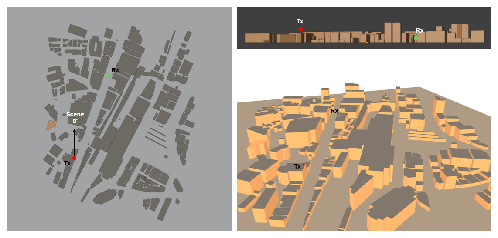
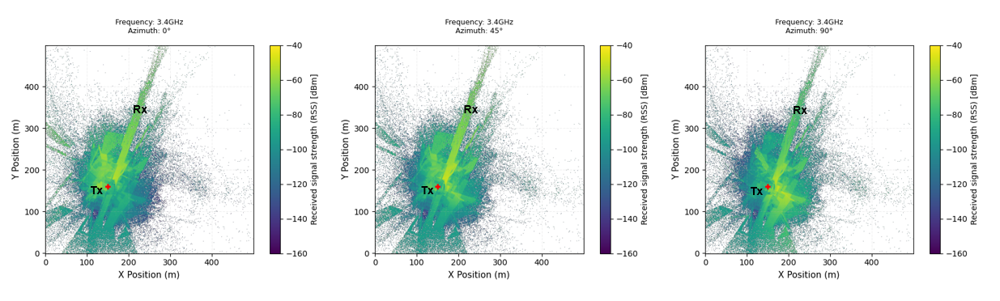
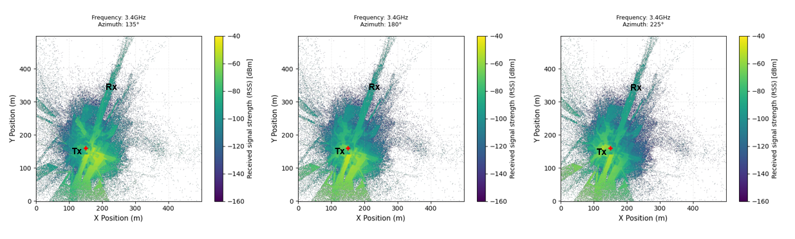
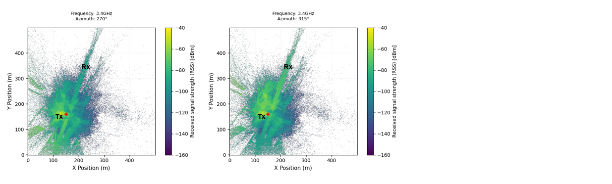
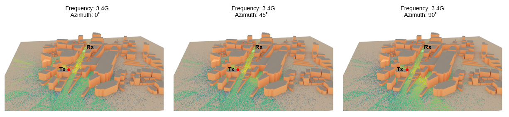
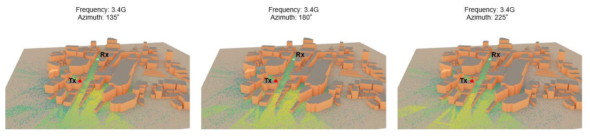
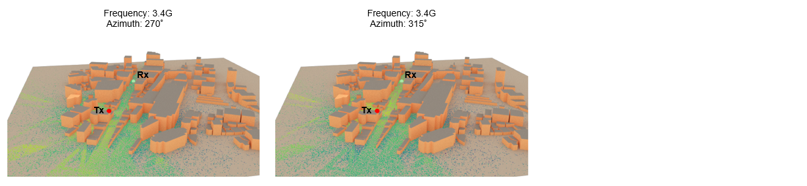
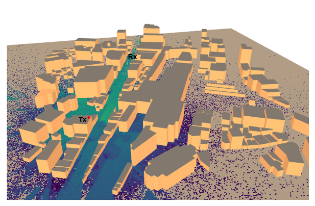

# Transmitter-001: Effect of Azimuth Changes in a Directional Antenna

## Test Description

<!-- Objective and Hypothesis and Expected Output-->

When implementing either a [Transmitter](https://nvlabs.github.io/sionna/rt/api/radio_devices.html#sionna.rt.Transmitter) or [Receiver](https://nvlabs.github.io/sionna/rt/api/radio_devices.html#sionna.rt.Receiver) in Sionna, there is an option to configure the orientation of the [Radio Device](https://nvlabs.github.io/sionna/rt/api/radio_devices.html#). For a [Transmitter](https://nvlabs.github.io/sionna/rt/api/radio_devices.html#sionna.rt.Transmitter), the common term for orientation in radio network implementation is called azimuth, where an azimuth of 0° means facing north. In this experiment, the effect of changing the azimuth of a single transmit antenna will be tested to understand its impact.

!!! example "Variables in this test"

    Tx Antenna Azimuths: 0°, 45°, 90°, 135°, 180°, 225°, 270°, 315°. 0° means facing north.

<!-- Test Scenario -->

For this test, a single Tx and Rx are deployed in a 500 m × 500 m urban outdoor environment. The initial azimuth of the transmitter is 0°, and the azimuth will be increased by 45° until a full circle is completed. The Rx will always be facing the transmitter. Simulation of [RSS](https://nvlabs.github.io/sionna/rt/api/radio_maps.html#sionna.rt.RadioMap.rss) through [Radio Maps](https://nvlabs.github.io/sionna/rt/api/radio_maps.html) in this scene will be used to evaluate the effect of changing azimuths.



!!! quote "Constants"

    ```python
    Carrier Frequency = 3.4 GHz
    Simulation Area = 500 x 500 m
    Tx Antenna Pattern = tr38901
    Tx Power = 18 dBm
    Tx Antenna Height = 18 m
    Tx Antenna Tilt = 20°
    Rx Antenna Pattern = iso
    Rx Antenna Height = 1.5 m
    Rx Orientation = Towards Tx
    ```

!!! warning "Default Transmitter Orientation in Sionna"

    The default transmitter orientation in Sionna is different from the compass bearing or Blender scene true north — it is shifted by 90° and rotates in a counterclockwise direction. Therefore, a necessary adjustment needs to be made to synchronize the scene true north (0°) with the default transmitter orientation. [Ref](https://nvlabs.github.io/sionna/rt/api/antenna_pattern.html#sionna.rt.AntennaPattern.show)

    | Compass Bearing | Scene Direction (Y Forward, Z Up) | Transmitter Azimuth Orientation |
    |-----------------|-----------------------------------|---------------------------------|
    | 0° (North)      | 0° (Y+)                           | 90°                             |
    | 90° (East)      | 90° (X+)                          | 0°                              |
    | 180° (South)    | 180° (Y-)                         | 270°                            |
    | 270° (West)     | 270° (X-)                         | 180°                            |

## Results

<!-- Result Discussion -->

#### Result 1: Received Signal Strength Effect through 2D Radio Map

Below are the results of RSS in the 2D Radio Map generated from [RadioMapSolver](https://nvlabs.github.io/sionna/rt/api/radio_map_solvers.html) when changing the azimuth from 0° to 315°. Strongest RSS can be seen rotating based on the azimuth direction.







#### Result 2: Received Signal Strength Effect through 3D Radio Map

Below are the results of RSS in the 3D Radio Map generated from [RadioMapSolver](https://nvlabs.github.io/sionna/rt/api/radio_map_solvers.html) and [Scene.render()](https://nvlabs.github.io/sionna/rt/api/scene.html#sionna.rt.Scene.render) when changing the azimuth from 0° to 315°. Strongest RSS can be seen rotating based on the azimuth direction.







Example of RSS in a 3D Radio Map generated from [RadioMapSolver](https://nvlabs.github.io/sionna/rt/api/radio_map_solvers.html) and [Scene.preview()](https://nvlabs.github.io/sionna/rt/api/scene.html#sionna.rt.Scene.preview). Preview allows 3D viewing and inspection when running code from a Jupyter notebook.



#### Key Takeaway

1. Changing the transmitter azimuth directly changes the direction of the strongest RSS.

## Source Code

Regenerate the results from [source](https://github.com/zulfadlizainal/sionna-results/tree/main/src) ⬇️

<details>
  <summary>Python</summary>

```python
# Import libraries
import numpy as np
from sionna.rt import load_scene, ITURadioMaterial, Transmitter, Receiver, PlanarArray, RadioMapSolver, PathSolver, Camera
import matplotlib.pyplot as plt
import pandas as pd
import os

# Import scene from blender mitsuba export (.xml)
scene = load_scene("blender-assets/omori-station.xml")

# Check objects in the scene
print("Check Scene Objects:")
print(f"Objects in scene: {list(scene.objects.keys())}")
print(f"Radio Materials in scene: {list(scene.radio_materials.keys())}")

# Add array for both Tx and Rx to scene
scene.tx_array = PlanarArray(num_rows=1, 
                             num_cols=1,
                             vertical_spacing=0.5,
                             horizontal_spacing=0.5,
                             pattern="tr38901",
                             polarization="V")

scene.rx_array = PlanarArray(num_rows=1, 
                             num_cols=1,
                             vertical_spacing=0.5,
                             horizontal_spacing=0.5,
                             pattern="iso",
                             polarization="V")

# Add frequency to scene
carrier_freq = 3.4e9 # In Hz
scene.frequency = carrier_freq

# Deploy Tx and Rx location

# Helper function to sync transmitter 0 degree with scene 0 degree
def compass_orientation(azimuth_deg, tilt_deg=0, roll_deg=0):

    # Sionna by default implement 0 degree Tx at X+ axis, -90 to achieve 0 degree at Y+ axis (North)
    sionna_azimuth = (90 - azimuth_deg) % 360

    # return radian
    return [
        float(np.deg2rad(sionna_azimuth)),
        float(np.deg2rad(tilt_deg)),
        float(np.deg2rad(roll_deg))
    ]

# Deploy Tx
tx_azimuth_deg = 0
tx_tilt_deg = 20

tx = Transmitter(
    "tx",
    position = [-100, -90, 18], # x, y, z (location and height, in meter)
    orientation=compass_orientation(azimuth_deg=tx_azimuth_deg,tilt_deg=tx_tilt_deg), 
    power_dbm=18
)

tx_power_dbm = tx.power_dbm[0]

# Deploy Rx
rx_azimuth_deg = 0
rx_tilt_deg = 0

rx = Receiver(
    "rx",
    [-30, 90, 1.5],
    orientation=[
        float(np.deg2rad(rx_azimuth_deg)), float(np.deg2rad(rx_tilt_deg)), 0.0]
)

# Point Rx to face Tx direction
rx.look_at(tx.position)

# Add Tx and Rx to the scene
scene.add(tx)
scene.add(rx)

# Plot 2D Radio Map - For every azimuths (Every 45 degree)

tx_azimuth_deg = range(0, 360, 45)

for i, azimuth in enumerate(tx_azimuth_deg):

    # Update Tx orientation
    tx.orientation = compass_orientation(azimuth_deg=azimuth, tilt_deg=tx_tilt_deg)

    # Plot 2D Radio Map
    rm_solver = RadioMapSolver()

    rm = rm_solver(
        scene,
        max_depth=10,
        samples_per_tx=10**7,
        cell_size=(1, 1),
        center=[0, 0, 0],
        size=[500, 500],
        orientation=[0, 0, 0]
    )

    plt.figure(figsize=(8, 10))

    # Show radio map
    rm.show(metric="rss")

    plt.title(
        f"Frequency: {carrier_freq/1e9}GHz\nAzimuth: {azimuth}°",
        fontsize=9,
        pad=15
    )
    plt.xlabel("X Position (m)", fontsize=11)
    plt.ylabel("Y Position (m)", fontsize=11)
    plt.clim(-160, -40)
    plt.grid(
        alpha=0.2,
        linestyle="--"
    )
    plt.tight_layout()
    plt.show()

# # Optional - Scene Preview
# scene.preview()

# # Optional - Scene Preview (Radio Map)
# rm_solver = RadioMapSolver()

# rm = rm_solver(
#         scene,
#         max_depth=10, # Number of maximum interation allowed per paths
#         samples_per_tx=10**7, # Number of rays launch in transmitter
#         cell_size=(1, 1),
#         center=[0, 0, 0],
#         size=[500, 500], # Size of area to simulate (meter)
#         orientation=[0, 0, 0]
#     )

# scene.preview(
#     radio_map=rm,

#     rm_metric="rss",
#     rm_db_scale=True,

#     rm_vmax = -40,
#     rm_vmin = -160,

#     show_devices=True,
#     show_orientations=True,

#     point_picker=False
# )

# # Optional - Scene Preview (Paths)
# p_solver = PathSolver()

# paths = p_solver(
#     scene,
#     max_depth=10,
#     samples_per_src=10**6
# )

# scene.preview(
#     paths=paths,

#     show_devices=True,
#     show_orientations=True,

#     point_picker=False
# )

# # Optional - 3D Scene Picture Render 
cam = Camera(
    position=(-140, -500, 200),
    look_at=rx.position
)

scene.render(
    camera=cam,
    radio_map=rm
)    
```

</details>
