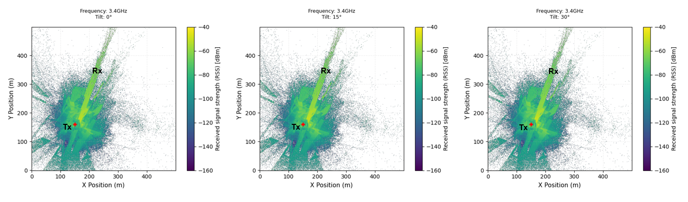
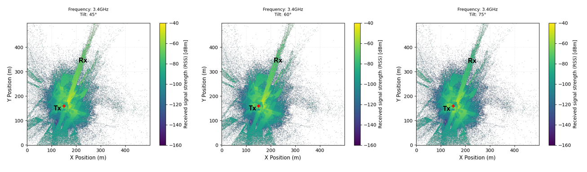
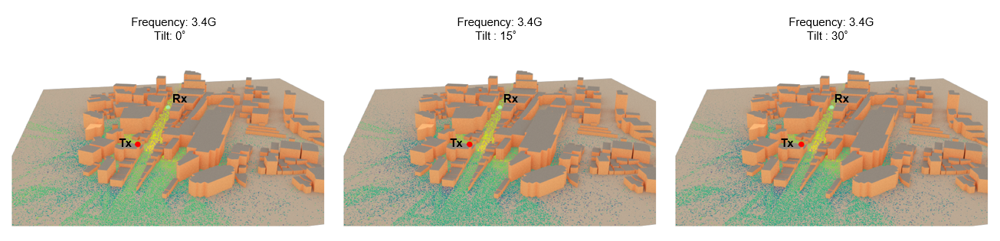
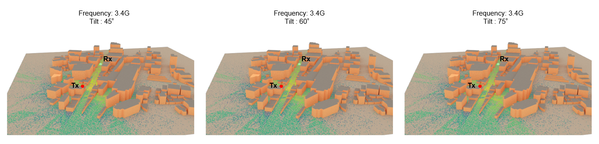
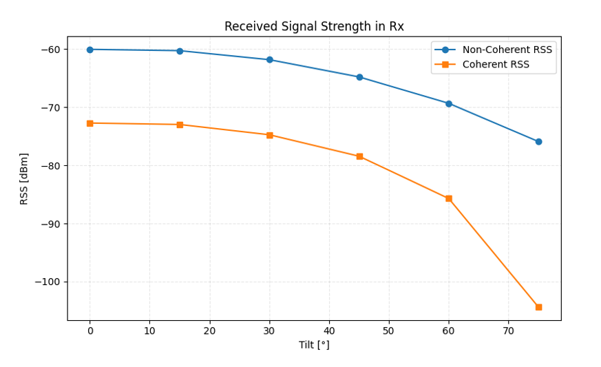

# Transmitter-002: Effect of Tilt Changes in a Directional Antenna

## Test Description

<!-- Objective and Hypothesis and Expected Output-->

When implementing either a [Transmitter](https://nvlabs.github.io/sionna/rt/api/radio_devices.html#sionna.rt.Transmitter) or [Receiver](https://nvlabs.github.io/sionna/rt/api/radio_devices.html#sionna.rt.Receiver) in Sionna, there is an option to configure the orientation of the [Radio Device](https://nvlabs.github.io/sionna/rt/api/radio_devices.html#). For a [Transmitter](https://nvlabs.github.io/sionna/rt/api/radio_devices.html#sionna.rt.Transmitter), the common term for orientation in the Y-axis in radio network implementation is called tilt, where a tilt of 0° means the antenna main lobe direction is parallel to the ground X plane. In this experiment, the effect of changing the tilt of a single transmit antenna will be tested to understand its impact.

!!! example "Variables in this test"

    Tx Antenna Tilt: 0°, 15°, 30°, 45°, 60°, 75°. 0° means the antenna main lobe direction is parallel to the ground X plane. +ve values mean down-tilting.

<!-- Test Scenario -->

For this test, a single Tx and Rx are deployed in a 500 m × 500 m urban outdoor environment. The initial tilt of the transmitter is 0°, and the tilt will be increased by 15° until the antenna is almost facing downward. The Rx will always be facing the transmitter. Simulation of [RSS](https://nvlabs.github.io/sionna/rt/api/radio_maps.html#sionna.rt.RadioMap.rss) through [Radio Maps](https://nvlabs.github.io/sionna/rt/api/radio_maps.html) in this scene will be used to evaluate the effect of changing the tilt.


!!! quote "Constants"

    ```python
    Carrier Frequency = 3.4 GHz
    Simulation Area = 500 x 500 m
    Tx Antenna Pattern = tr38901
    Tx Power = 18 dBm
    Tx Antenna Height = 18 m
    Tx Antenna Azimuth = 45°
    Rx Antenna Pattern = iso
    Rx Antenna Height = 1.5 m
    Rx Orientation = Towards Tx
    ```

!!! info "Default Transmitter Tilt Orientation in Sionna"

    The default transmitter tilt orientation in Sionna is similar to common radio network planner expectations, where 0° means the antenna is not tilted (main lobe is parallel to the ground X plane), while +ve degrees mean the antenna is tilted facing downward. [Ref](https://nvlabs.github.io/sionna/rt/api/antenna_pattern.html#sionna.rt.AntennaPattern.show)

## Results

<!-- Result Discussion -->

#### Result 1: Received Signal Strength Effect Through 2D Radio Map

Below are the RSS results in the 2D Radio Map generated from [RadioMapSolver](https://nvlabs.github.io/sionna/rt/api/radio_map_solvers.html) when changing the tilt from 0° to 75°. As more down tilt is applied, lower RSS in the receiver direction can be observed because the main lobe becomes more directed toward the ground.





#### Result 2: Received Signal Strength Effect Through 3D Radio Map

Below are the RSS results in the 3D Radio Map generated from [RadioMapSolver](https://nvlabs.github.io/sionna/rt/api/radio_map_solvers.html) and [Scene.render()](https://nvlabs.github.io/sionna/rt/api/scene.html#sionna.rt.Scene.render) when changing the tilt from 0° to 75°. As more down tilt is applied, lower RSS in the receiver direction can be observed because the main lobe becomes more directed toward the ground.





#### Result 3: Coherent vs Non-Coherent RSS at the Receiver

RSS at the receiver can be calculated [coherently](/Multipath/Multipath-001/#result-4-received-signal-strength-at-the-receiver-derived-from-a) or [non-coherently](/Multipath/Multipath-001/#result-4-received-signal-strength-at-the-receiver-derived-from-a) when using [PathSolver](https://nvlabs.github.io/sionna/rt/api/paths_solvers.html). As more down tilt is applied (from 0° to 75°), lower RSS in the receiver direction can be observed because the main lobe becomes more directed toward the ground.

The coherent RSS is consistently lower than the non-coherent RSS because the coherent calculation accounts for constructive and destructive interference between multipath components through their phase relationships. In this scenario, destructive interference dominates at the receiver location, resulting in a lower total received power when the paths are combined coherently.



#### Key Takeaway

1. Changing the transmitter tilt directly changes the direction of the strongest RSS.

2. Increasing down tilt reduces the RSS observed in the receiver direction as more energy is directed toward the ground.

## Source Code

Regenerate the results from [source](https://github.com/zulfadlizainal/sionna-results/tree/main/src) ⬇️

<details>
  <summary>Python</summary>

```python
# Import libraries
import numpy as np
from sionna.rt import load_scene, ITURadioMaterial, Transmitter, Receiver, PlanarArray, RadioMapSolver, PathSolver, Camera
import matplotlib.pyplot as plt
import pandas as pd
import os

# Import scene from blender mitsuba export (.xml)
scene = load_scene("blender-assets/omori-station.xml")

# Check objects in the scene
print("Check Scene Objects:")
print(f"Objects in scene: {list(scene.objects.keys())}")
print(f"Radio Materials in scene: {list(scene.radio_materials.keys())}")

# Add array for both Tx and Rx to scene
scene.tx_array = PlanarArray(num_rows=1, 
                             num_cols=1,
                             vertical_spacing=0.5,
                             horizontal_spacing=0.5,
                             pattern="tr38901",
                             polarization="V")

scene.rx_array = PlanarArray(num_rows=1, 
                             num_cols=1,
                             vertical_spacing=0.5,
                             horizontal_spacing=0.5,
                             pattern="iso",
                             polarization="V")

# Add frequency to scene
carrier_freq = 3.4e9 # In Hz
scene.frequency = carrier_freq

# Deploy Tx and Rx location

# Helper function to sync transmitter azimuth 0 degree with scene 0 degree
def compass_orientation(azimuth_deg, tilt_deg=0, roll_deg=0):

    # Sionna by default implement 0 degree Tx azimuth at X+ axis, -90 to achieve 0 degree at Y+ axis (North)
    sionna_azimuth = (90 - azimuth_deg) % 360

    # return radian
    return [
        float(np.deg2rad(sionna_azimuth)),
        float(np.deg2rad(tilt_deg)),
        float(np.deg2rad(roll_deg))
    ]

# Deploy Tx
tx_azimuth_deg = 45
tx_tilt_deg = 0

tx = Transmitter(
    "tx",
    position = [-100, -90, 18], # x, y, z (location and height, in meter)
    orientation=compass_orientation(azimuth_deg=tx_azimuth_deg,tilt_deg=tx_tilt_deg), 
    power_dbm=18
)

tx_power_dbm = tx.power_dbm[0]

# Deploy Rx
rx_azimuth_deg = 0
rx_tilt_deg = 0

rx = Receiver(
    "rx",
    [-30, 90, 1.5],
    orientation=[
        float(np.deg2rad(rx_azimuth_deg)), float(np.deg2rad(rx_tilt_deg)), 0.0]
)

# Point Rx to face Tx direction
rx.look_at(tx.position)

# Add Tx and Rx to the scene
scene.add(tx)
scene.add(rx)

# Solve radio map and paths - for every tilt (every 15 degree)

# Define empty list
rss_list_noncoherent = []
rss_list_coherent = []
tilt_list = []

# Define range of down tilt to test
tx_tilt_deg = range(0, 90, 15)

for i, tilt in enumerate(tx_tilt_deg):

    print(f"tx_tilt_deg = {tilt}°")

    # Update Tx tilt
    tx.orientation = compass_orientation(azimuth_deg=tx_azimuth_deg, tilt_deg=tilt)

    # Solve radio map
    rm_solver = RadioMapSolver()

    rm = rm_solver(
        scene,
        max_depth=10,
        samples_per_tx=10**7,
        cell_size=(1, 1),
        center=[0, 0, 0],
        size=[500, 500],
        orientation=[0, 0, 0]
    )

    # Plot 2D Radio map
    plt.figure(figsize=(8, 10))

    rm.show(metric="rss")

    plt.title(
        f"Frequency: {carrier_freq/1e9}GHz\nTilt: {tilt}°",
        fontsize=9,
        pad=15
    )
    plt.xlabel("X Position (m)", fontsize=11)
    plt.ylabel("Y Position (m)", fontsize=11)
    plt.clim(-160, -40)
    plt.grid(
        alpha=0.2,
        linestyle="--"
    )
    plt.tight_layout()
    plt.show()

    # Plot 3D radio map
    cam = Camera(
    position=(-140, -500, 200),
    look_at=rx.position
    )

    scene.render(
        camera=cam,
        radio_map=rm
    )

    # Solve paths
    p_solver = PathSolver()

    paths = p_solver(
        scene,
        max_depth=10,
        samples_per_src=10**6
    )

    # Extract path coefficients (a function return 2 components: a_real, a_imag)
    a_real, a_imag = paths.a
    a_real = a_real.numpy()
    a_imag = a_imag.numpy()

    # Reconstruct complex channel coefficients in real and imaginary form
    a = a_real + 1j * a_imag

  
    # Restructure multipath properties into array (in a list)
    num_paths = a.shape[-1]
    path_data = []

    for i in range(num_paths):

        # Get channel coefficient (real + imaginary) one by one
        a_coeff = a[0, 0, 0, 0, i]

        # Extract real and imaginary components
        real_coeff = np.real(a_coeff)
        imag_coeff = np.imag(a_coeff)

        # Magnitude and phase
        magnitude = np.abs(a_coeff) 
        phase_rad = np.angle(a_coeff) 

        # Channel Gain
        channel_path_gain = magnitude**2
        channel_path_gain_db = 10*np.log10(channel_path_gain)

        path_data.append({
            "path_id": i,

            "real_coeff": float(real_coeff),
            "imag_coeff": float(imag_coeff),

            "magnitude": float(magnitude),
            "phase_rad": float(phase_rad),
            "phase_deg": float(np.degrees(phase_rad)),

            "channel_path_gain": float(channel_path_gain),
            "channel_path_gain_db": float(channel_path_gain_db),
        })

    # Put array in Dataframe
    df_paths = pd.DataFrame(path_data)

    # Calculate Received Signal Strength (RSS) at Receivers 

    # Non Coherent Case (Just a sum of power in Rx)
    total_channel_path_gain = 10*np.log10(df_paths['channel_path_gain'].sum())
    rss_non_coherent = tx_power_dbm+total_channel_path_gain

    # Coherent Case (Consider constructive & destructive effect caused by phase delay in Rx)
    total_real = df_paths['real_coeff'].sum()
    total_imag = df_paths['imag_coeff'].sum()
    total_magnitude = np.sqrt(total_real**2 + total_imag**2)
    total_channel_path_gain = 10*np.log10(total_magnitude**2)
    rss_coherent = tx_power_dbm+total_channel_path_gain

    # Save result in a list
    tilt_list.append(tilt)
    rss_list_noncoherent.append(rss_non_coherent)
    rss_list_coherent.append(rss_coherent)


# Plot RSS (Coherent vs Non-Coherent) line chart
plt.figure(figsize=(8, 5))

plt.plot(
    tilt_list,
    rss_list_noncoherent,
    marker='o',
    label='Non-Coherent RSS'
)

plt.plot(
    tilt_list,
    rss_list_coherent,
    marker='s',
    label='Coherent RSS'
)

plt.legend()

plt.xlabel("Tilt [°]")
plt.ylabel("RSS [dBm]")
plt.title("Received Signal Strength in Rx")
plt.grid(True, linestyle="--", alpha=0.3)

plt.tight_layout()
plt.show()

# # Optional - Scene Preview
# scene.preview()

# # Optional - Scene Preview (Radio Map)
# rm_solver = RadioMapSolver()

# rm = rm_solver(
#         scene,
#         max_depth=10, # Number of maximum interation allowed per paths
#         samples_per_tx=10**7, # Number of rays launch in transmitter
#         cell_size=(1, 1),
#         center=[0, 0, 0],
#         size=[500, 500], # Size of area to simulate (meter)
#         orientation=[0, 0, 0]
#     )

# scene.preview(
#     radio_map=rm,

#     rm_metric="rss",
#     rm_db_scale=True,

#     rm_vmax = -40,
#     rm_vmin = -160,

#     show_devices=True,
#     show_orientations=True,

#     point_picker=False
# )

# # Optional - Scene Preview (Paths)
# p_solver = PathSolver()

# paths = p_solver(
#     scene,
#     max_depth=10,
#     samples_per_src=10**6
# )

# scene.preview(
#     paths=paths,

#     show_devices=True,
#     show_orientations=True,

#     point_picker=False
# )
```

</details>
